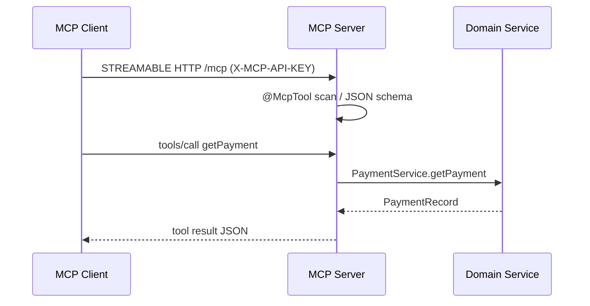
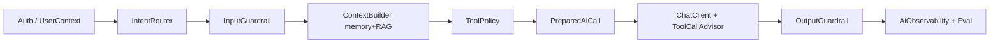
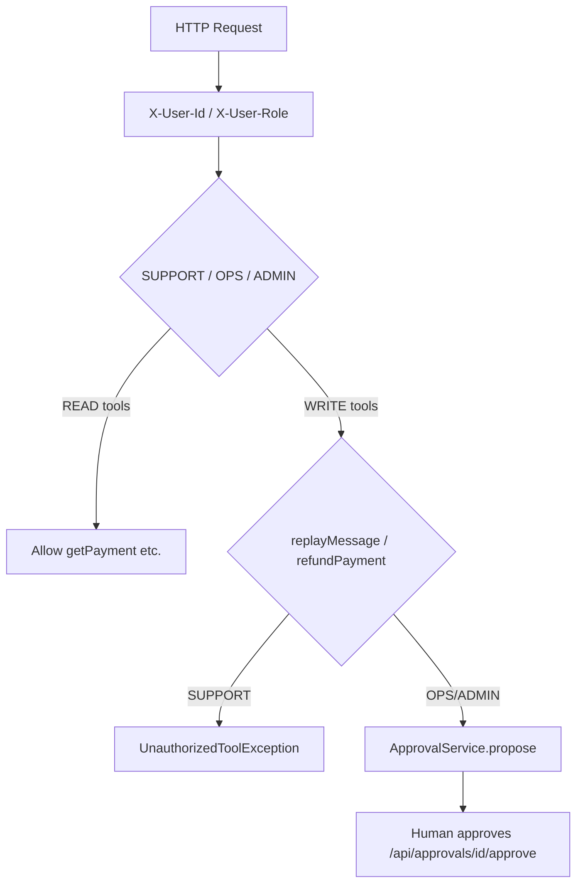

# FinTech AI Ops Assistant

Multi-module Java 21 platform demonstrating **Spring Boot 3.4.5**, **Spring AI 1.1.8**, in-process `@Tool` advisors, MCP streamable-HTTP servers, RAG, and an interview-grade AI harness — runnable **without an OpenAI API key** via `OpsScriptedChatModel`.

## Modules

| Module | Purpose |
|--------|---------|
| `common-model` | Shared records, enums, exceptions |
| `domain-services` | In-memory payment/customer/Kafka/reporting + auth/approval |
| `rag-service` | `SimpleVectorStore` + hash embeddings + policy docs |
| `ai-harness` | Intent routing, guardrails, context, tool policy, observability |
| `payment-mcp-server` | MCP tools for payments (port **8091**) |
| `customer-mcp-server` | MCP customer tools (port **8092**) |
| `kafka-mcp-server` | MCP Kafka ops (port **8093**) |
| `reporting-mcp-server` | MCP reporting (port **8094**) |
| `ai-assistant` | Main API (port **8080**) — ChatClient + `@Tool` |

## Seed data

- Payment **PAY-123** — `FAILED`, `BANK_TIMEOUT`, bank **HSBC**, customer **CUST-100**, `retryAllowed=true`
- Kafka message **MSG-501** keyed on PAY-123

## Quick start

```bash
export PATH=/tmp/apache-maven-3.9.9/bin:$PATH
cd ai-fintech-platform
mvn -q -DskipTests package
mvn -pl ai-assistant spring-boot:run
```

```bash
curl -s -X POST http://localhost:8080/api/ai/chat \
  -H 'Content-Type: application/json' \
  -H 'X-User-Id: ops-1' -H 'X-User-Role: OPS' \
  -d '{"conversationId":"c1","message":"Why did payment PAY-123 fail?"}'
```

Default: `app.ai.provider=scripted` — no external LLM key required.

Optional infra: `docker compose up -d` (Postgres, Redis, Redpanda). **Default run uses in-memory stores.**

## Architecture

```mermaid
flowchart TB
  subgraph Client
    UI[Ops Console / curl]
  end
  subgraph ai-assistant
    AC[AiController]
    H[AiHarness]
    CC[ChatClient + Advisors]
    T[@Tool beans]
  end
  subgraph domain
    PS[PaymentService]
    KS[KafkaOpsService]
    RS[ReportingService]
    AUTH[ToolAuthorizationService]
    APR[ApprovalService]
  end
  subgraph rag
    RAG[RagService / VectorStore]
    DOCS[(policy .md)]
  end
  subgraph mcp_servers[MCP Servers 8091-8094]
    MCP[@McpTool servers]
  end
  UI --> AC --> H --> CC
  CC --> T --> AUTH
  T --> PS & KS & RS
  H --> RAG --> DOCS
  CC -. optional .-> MCP
```

## MCP lifecycle



## Harness pipeline



## Security model



- **SUPPORT**: read-only tools
- **OPS/ADMIN**: may propose writes; execution after approval
- **MCP servers**: `X-MCP-API-KEY=dev-mcp-key` (disable locally via `app.mcp.security.enabled=false`; **production MUST auth**)

## Key APIs

- `POST /api/ai/chat` — harness + ChatClient
- `POST /api/approvals/{id}/approve` — execute pending write
- MCP: `spring.ai.mcp.server.protocol=STREAMABLE`, endpoint `/mcp`

## Tests

```bash
mvn -pl ai-assistant -am test
```

Covers PAY-123 investigation, prompt injection block, unauthorized replay, approval gate, RAG context.

## Profiles

- `application.yml` — scripted provider, MCP client **disabled**
- `application-mcp.yml` — optional remote MCP client to payment server
