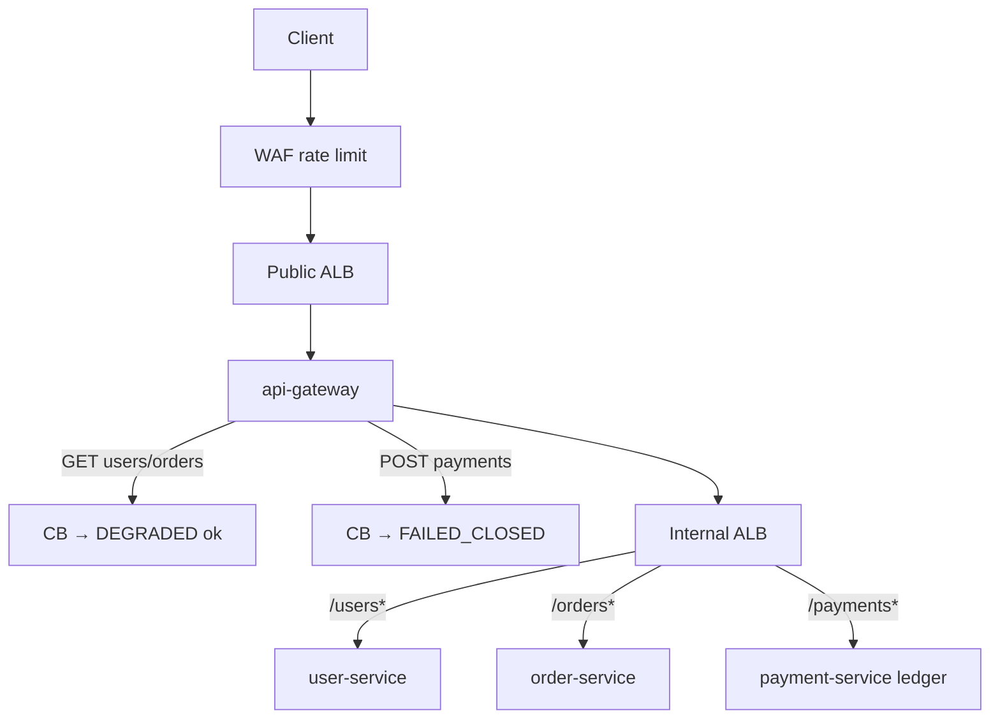

## Why you could not find this on the blog before

The Java lab lived only in the Git repo folder `spring-gateway-live-lab/`. The hub at [/api-gateway](/api-gateway/) is interview theory — it pointed at an older utilities lab (`spring-api-gateway-lab/`).

**This page is the searchable home for the full live implementation.**

| Find it | URL / path |
|---------|------------|
| **This blog page** | [/distributed-systems/gateway-live-interview-lab/](/distributed-systems/gateway-live-interview-lab/) |
| Site search | [/search](/search/) → type `fail-closed` or `gateway-live` |
| API Gateway hub | [/api-gateway/#lab](/api-gateway/#lab) (links here) |
| Repo folder | `spring-gateway-live-lab/` |
| PR | https://github.com/vibhuagwl/vibhu-tech-blog/pull/121 |

---

## What the lab builds

```text
LOCAL (learn)                         AWS (production path)
Client → Gateway → lb:// → services   Internet → WAF → Public ALB → Gateway
              ↘ Eureka                              → Internal ALB → user/order/payment
```

| Phase | What |
|-------|------|
| 1 | Gateway routes + `StripPrefix` + correlation GlobalFilter |
| 2 | Eureka + `lb://user-service` |
| 3 | Multi-instance RoundRobin (`INSTANCE_ID` / port in JSON) |
| AWS | Profile `aws`: no Eureka, internal ALB, CB/timeouts, WAF, autoscaling |
| Payments | Idempotent ledger + **fail-closed** CB fallback (never fake `SETTLED`) |

Related hub: [/api-gateway](/api-gateway/) · [/resilience4j](/resilience4j/)

---

## Architecture (AWS / banking)



**Interview line:** Reads may degrade. Money **fails closed**. `SETTLED` only after ledger commit; clients retry with the same `Idempotency-Key`.

---

## Run locally

```bash
cd spring-gateway-live-lab

# Eureka learning path
mvn -pl eureka-server spring-boot:run
mvn -pl user-service spring-boot:run
mvn -pl order-service spring-boot:run
mvn -pl payment-service spring-boot:run
mvn -pl api-gateway spring-boot:run

# Or AWS-profile stand-in (Compose DNS ≈ internal ALB)
docker compose -f docker-compose.aws.yml up --build

./scripts/smoke-payments.sh
```

Payment smoke:

```bash
curl -X POST http://localhost:8080/api/payments \
  -H 'Content-Type: application/json' \
  -H 'Idempotency-Key: pay-001' \
  -d '{"fromAccountId":1001,"toAccountId":1002,"amount":25.00}'
```

---

## Source map (repo)

| Path | Role |
|------|------|
| `api-gateway/` | Spring Cloud Gateway, CB filters, fail-closed fallback |
| `payment-service/` | Idempotent ledger (`LedgerPaymentService`) |
| `user-service/` / `order-service/` | Downstream demos |
| `eureka-server/` | Local discovery only |
| `aws/terraform/` | ECR, ECS, public+internal ALB, WAF, alarms, autoscaling |
| `aws/README.md` | Production deploy steps |

---

## Full code on this page

### 1) Fail-closed gateway fallback

Repo: `api-gateway/.../FallbackRoutesConfig.java`

```java
@Configuration
public class FallbackRoutesConfig {

  @Bean
  RouterFunction<ServerResponse> fallbackRoutes() {
    return RouterFunctions.route()
        .GET("/fallback/users", req -> degradedRead("user-service"))
        .GET("/fallback/orders", req -> degradedRead("order-service"))
        .POST("/fallback/payments", req -> failClosedPayment())
        .GET("/fallback/payments", req -> failClosedPayment())
        .build();
  }

  private static Mono<ServerResponse> degradedRead(String downstream) {
    return ServerResponse.status(HttpStatus.SERVICE_UNAVAILABLE)
        .contentType(MediaType.APPLICATION_JSON)
        .bodyValue(Map.of(
            "status", "DEGRADED",
            "downstream", downstream,
            "message", "Circuit open or downstream timeout — retry later"));
  }

  /** Banking: never invent SETTLED when the circuit is open. */
  private static Mono<ServerResponse> failClosedPayment() {
    Map<String, Object> body = new LinkedHashMap<>();
    body.put("status", "FAILED_CLOSED");
    body.put("downstream", "payment-service");
    body.put("settled", false);
    body.put("message",
        "Payment NOT settled — circuit open or timeout. Retry with the same Idempotency-Key; never assume success.");
    return ServerResponse.status(HttpStatus.SERVICE_UNAVAILABLE)
        .contentType(MediaType.APPLICATION_JSON)
        .bodyValue(body);
  }
}
```

### 2) Gateway payment route (AWS profile)

Repo: `api-gateway/src/main/resources/application-aws.yml`

```yaml
spring:
  cloud:
    gateway:
      httpclient:
        connect-timeout: 2000
        response-timeout: 5s
      default-filters:
        - name: Retry
          args:
            retries: 2
            methods: GET   # never blind-retry payment POST
      routes:
        - id: payment-service
          uri: ${PAYMENT_SERVICE_URI:http://payment-service:8084}
          predicates:
            - Path=/api/payments/**
          filters:
            - StripPrefix=1
            - name: CircuitBreaker
              args:
                name: paymentServiceCB
                fallbackUri: forward:/fallback/payments
```

### 3) Strong consistency ledger (demo ACID)

Repo: `payment-service/.../LedgerPaymentService.java`

```java
@Service
public class LedgerPaymentService {
  private final Object ledgerLock = new Object();
  private final Map<Long, BigDecimal> balances = new ConcurrentHashMap<>();
  private final Map<String, PaymentRecord> byIdempotencyKey = new ConcurrentHashMap<>();

  public PaymentRecord pay(String idempotencyKey, PaymentRequest request) {
    if (idempotencyKey == null || idempotencyKey.isBlank()) {
      throw new ResponseStatusException(HttpStatus.BAD_REQUEST, "Idempotency-Key header required");
    }
    PaymentRecord existing = byIdempotencyKey.get(idempotencyKey);
    if (existing != null) return existing; // safe client retry

    synchronized (ledgerLock) {
      // … validate balances …
      balances.put(from, fromBal.subtract(amount));
      balances.put(to, toBal.add(amount));
      PaymentRecord settled = new PaymentRecord(..., PaymentStatus.SETTLED, ...);
      byIdempotencyKey.put(idempotencyKey, settled);
      return settled; // SETTLED only after both sides update
    }
  }
}
```

### 4) Correlation GlobalFilter

Repo: `api-gateway/.../CorrelationLoggingGlobalFilter.java`

```java
@Component
public class CorrelationLoggingGlobalFilter implements GlobalFilter, Ordered {
  public static final String HEADER = "X-Correlation-ID";

  @Override
  public Mono<Void> filter(ServerWebExchange exchange, GatewayFilterChain chain) {
    String correlationId = Optional.ofNullable(exchange.getRequest().getHeaders().getFirst(HEADER))
        .filter(s -> !s.isBlank())
        .orElse(UUID.randomUUID().toString());
    ServerWebExchange mutated = exchange.mutate()
        .request(exchange.getRequest().mutate().header(HEADER, correlationId).build())
        .build();
    mutated.getResponse().getHeaders().set(HEADER, correlationId);
    long start = System.currentTimeMillis();
    return chain.filter(mutated)
        .doOnSuccess(v -> log.info("gateway requestId={} path={} latencyMs={}",
            correlationId, mutated.getRequest().getURI().getRawPath(),
            System.currentTimeMillis() - start));
  }

  @Override
  public int getOrder() { return Ordered.HIGHEST_PRECEDENCE; }
}
```

---

## Read vs payment fallback (say this)

| Path | CB open response | Money moved? |
|------|------------------|--------------|
| `GET /api/users/**` | `DEGRADED` | N/A |
| `POST /api/payments` | `FAILED_CLOSED`, `settled: false` | **No** |
| Ledger success | `SETTLED` | **Yes** |

---

## AWS Terraform (production path)

```bash
cd spring-gateway-live-lab/aws/terraform
cp terraform.tfvars.example terraform.tfvars   # vpc + private subnets
terraform init && terraform apply
# after images: ./scripts/build-push-ecr.sh
```

Creates: ECR, ECS Fargate, public ALB, **internal ALB** (`/users*`, `/orders*`, `/payments*`), WAF rate limit, autoscaling, CloudWatch alarms.

Details: repo `spring-gateway-live-lab/aws/README.md`.

---

## 30-second interview close

> “Gateway owns cross-cutting policy. On AWS I drop Eureka for ALB + Cloud Map or internal ALB. For payments I use timeouts and a circuit breaker that **fails closed** — never a fake success. Settlement is an idempotent ledger commit; clients retry with the same Idempotency-Key.”
