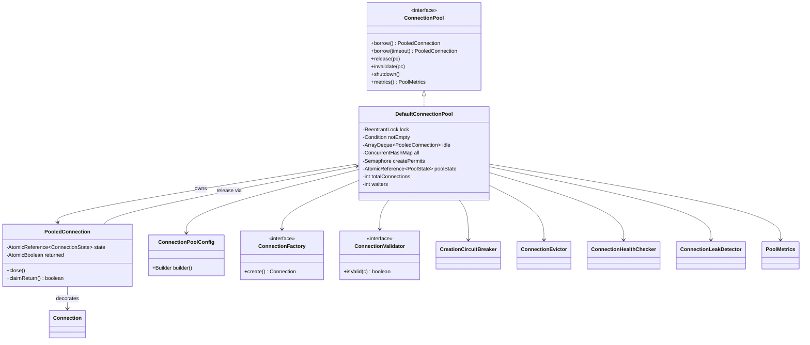
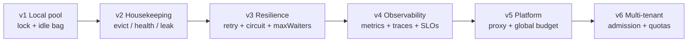

# LLD — Architect-Level Connection Pool (Java)

Staff / Principal interview design: a **process-local** Java connection pool. No Spring. Java 17+. Runnable companion: `connection-pool-lld/` (`mvn test`).

> This pool does **not** provide distributed locking or cluster-wide capacity control. Per-JVM `maxPoolSize` × replica count is how you accidentally DDoS your database.

---

## PART 1 — Architecture

### Class diagram



### Responsibilities

| Component | Owns |
|---|---|
| `DefaultConnectionPool` | Capacity, idle bag, waiters, borrow/release, shutdown FSM |
| `PooledConnection` | State machine, double-release claim, borrow metadata / leak stack |
| `ConnectionFactory` | Physical create (JDBC, gRPC channel, etc.) — injected |
| `ConnectionValidator` | Liveness probe (e.g. `SELECT 1`) — outside lock |
| `Semaphore createPermits` | Cap concurrent creates → storm control |
| `CreationCircuitBreaker` | Fail-fast when backend is down |
| `ConnectionEvictor` | Idle timeout above `minPoolSize` |
| `ConnectionHealthChecker` | Background validate idle connections |
| `ConnectionLeakDetector` | Flag borrowed past threshold |
| `PoolMetrics` | Counters / gauges for SRE |

### Concurrency model (one paragraph)

One `ReentrantLock` + `Condition notEmpty` serializes idle-bag mutations and waiter accounting. Creation, validation, and physical close run **outside** the lock. A `Semaphore(maxConcurrentCreators)` throttles parallel `factory.create()`. `ConcurrentHashMap` tracks all wrappers for eviction/leak scans without holding the pool lock for the whole scan. Linearization for “who got this idle connection” is `idle.pollFirst()` under the lock; for double-release it is `returned.compareAndSet(false, true)`.

### Invariants

1. `totalConnections <= maxPoolSize` (slot reserved under lock **before** unlock+create).
2. A connection is never `IDLE` and `BORROWED` at the same time.
3. Double `close()` / `release()` is idempotent — idle count never inflates.
4. Borrow after `SHUTTING_DOWN` / `CLOSED` fails with `PoolShutdownException`.
5. Slow I/O (create / validate / close) never holds the pool lock.
6. Waiters are bounded by `maxWaiters` (admission control).

### Runnable project

```text
connection-pool-lld/
  src/main/java/com/vibhu/connectionpool/...
  src/test/java/.../DefaultConnectionPoolTest.java

cd connection-pool-lld && mvn test
```

---

## PART 2 — Key code excerpts

### Config builder

```java
public static final class Builder {
  private int minPoolSize = 1;
  private int maxPoolSize = 10;
  private Duration acquisitionTimeout = Duration.ofSeconds(30);
  private Duration idleTimeout = Duration.ofMinutes(5);
  private Duration maxLifetime = Duration.ofMinutes(30);
  private int maxCreateRetries = 2;
  private int maxConcurrentCreators = 2; // storm throttle
  private int maxWaiters = 500;          // admission control
  private boolean fair = false;
  private Duration leakDetectionThreshold = Duration.ZERO;
  private Duration shutdownGracePeriod = Duration.ofSeconds(10);
  private boolean validateOnBorrow = true;
  private boolean validateOnReturn = false;

  public ConnectionPoolConfig build() {
    if (minPoolSize > maxPoolSize) {
      throw new IllegalArgumentException("minPoolSize <= maxPoolSize");
    }
    if (maxConcurrentCreators < 1) {
      throw new IllegalArgumentException("maxConcurrentCreators >= 1");
    }
    if (acquisitionTimeout.isNegative()) {
      throw new IllegalArgumentException("acquisitionTimeout must be non-negative");
    }
    return new ConnectionPoolConfig(this);
  }
}
```

Interview signal: defaults are opinionated (30s acquire timeout, create throttle = 2). Unbounded wait is a production footgun — reject it unless explicitly justified.

### Borrow / release critical sections

```java
private PooledConnection pollOrWaitOrCreate(long deadlineNanos) {
  lock.lock();
  try {
    while (true) {
      ensureRunning();
      PooledConnection idleConn = idle.pollFirst();
      if (idleConn != null) {
        // LINEARIZATION: only one thread gets this conn
        idleConn.markBorrowed(/* captureStack */ leakEnabled);
        publishCounts();
        return idleConn;
      }

      if (totalConnections < config.maxPoolSize()) {
        totalConnections++;          // reserve slot UNDER lock
        publishCounts();
        lock.unlock();
        try {
          PooledConnection created = createNewConnectionReserved();
          lock.lock();
          created.markBorrowed(leakEnabled);
          return created;
        } catch (RuntimeException ex) {
          // roll back reservation, signal waiters, rethrow
          ...
        }
      }

      if (waiters >= config.maxWaiters()) {
        throw new PoolCapacityExceededException("Too many waiters");
      }
      long remaining = deadlineNanos - System.nanoTime();
      if (remaining <= 0) return null;
      waiters++;
      try {
        if (!notEmpty.await(remaining, TimeUnit.NANOSECONDS)) return null;
      } finally {
        waiters--;
      }
    }
  } finally {
    if (lock.isHeldByCurrentThread()) lock.unlock();
  }
}
```

```java
public void release(PooledConnection connection) {
  if (!connection.claimReturn()) {
    return; // double-release: no-op
  }
  if (shouldRetire(connection)) {
    destroyConnection(connection, "retire-on-return");
    return;
  }
  lock.lock();
  try {
    if (poolState.get() != PoolState.RUNNING) {
      lock.unlock();
      destroyConnection(connection, "release-during-shutdown");
      return;
    }
    connection.markIdle();
    idle.addLast(connection);
    notEmpty.signal();   // wake one waiter
    publishCounts();
  } finally {
    if (lock.isHeldByCurrentThread()) lock.unlock();
  }
}
```

### PooledConnection — AutoCloseable + double-release

```java
public final class PooledConnection implements Connection {
  private final AtomicReference<ConnectionState> state =
      new AtomicReference<>(ConnectionState.CREATED);
  private final AtomicBoolean returned = new AtomicBoolean(false);

  /** First closer wins; second close() is a no-op. */
  boolean claimReturn() {
    return returned.compareAndSet(false, true);
  }

  /** try-with-resources → return to pool, NOT physical close. */
  @Override
  public void close() {
    pool.release(this);
  }

  void markBorrowed(boolean captureStack) {
    returned.set(false);
    borrowedAtNanos = System.nanoTime();
    borrowerThread = Thread.currentThread().getName();
    if (captureStack) {
      borrowStack = Thread.currentThread().getStackTrace();
    }
    state.set(ConnectionState.BORROWED);
  }
}
```

Usage:

```java
try (PooledConnection c = pool.borrow()) {
  c.underlying().execute("...");
} // close() → release(); second close() is safe
```

### Creation throttling semaphore

```java
private PooledConnection createNewConnectionReserved() {
  if (!circuitBreaker.allowRequest()) {
    throw new ConnectionCreationException("Connection creation circuit is open");
  }
  boolean acquired = createPermits.tryAcquire(
      config.acquisitionTimeout().toMillis(), TimeUnit.MILLISECONDS);
  if (!acquired) {
    throw new ConnectionCreationException("Timed out acquiring connection-create permit");
  }
  try {
    int attempt = 0;
    while (true) {
      try {
        Connection raw = factory.create(); // OUTSIDE pool lock
        PooledConnection pc = new PooledConnection(idSeq.incrementAndGet(), raw, this);
        all.put(pc.id(), pc);
        circuitBreaker.recordSuccess();
        return pc;
      } catch (RuntimeException ex) {
        circuitBreaker.recordFailure();
        Optional<Duration> delay = retryStrategy.nextDelay(attempt, ex);
        if (delay.isEmpty()) throw wrap(ex);
        sleep(delay.get());
        attempt++;
      }
    }
  } finally {
    createPermits.release();
  }
}
```

### Shutdown state machine

```text
RUNNING ──CAS──► SHUTTING_DOWN ──► CLOSED
                    │
                    ├─ stop evictor / health / leak threads
                    ├─ signalAll(notEmpty)  → waiters fail fast
                    ├─ close idle immediately
                    ├─ grace period for in-flight borrowers
                    └─ force-close remaining borrowed
```

```java
public void shutdown() {
  if (!poolState.compareAndSet(PoolState.RUNNING, PoolState.SHUTTING_DOWN)
      && poolState.get() == PoolState.CLOSED) {
    return; // idempotent
  }
  poolState.set(PoolState.SHUTTING_DOWN);
  leakDetector.stop();
  evictor.stop();
  healthChecker.stop();

  lock.lock();
  try {
    notEmpty.signalAll();
    List<PooledConnection> toClose = new ArrayList<>(idle);
    idle.clear();
    lock.unlock();

    for (PooledConnection pc : toClose) {
      physicalClose(pc, "shutdown-idle");
    }
    // wait up to shutdownGracePeriod for borrowed to return
    ...
    for (PooledConnection pc : new ArrayList<>(all.values())) {
      pc.claimReturn();
      physicalClose(pc, "shutdown-force");
    }
  } finally {
    poolState.set(PoolState.CLOSED);
  }
}
```

---

## PART 3 — Concurrency walkthrough

`maxPoolSize = 3`. Threads T1–T4.

```text
t0  idle=[]  total=0  waiters=0
    T1 borrow → create C1 → BORROWED
    T2 borrow → create C2 → BORROWED
    T3 borrow → create C3 → BORROWED
    State: idle=[]  total=3  active=3  waiters=0

t1  T4 borrow → pool full → waiters=1 → await(notEmpty)
    State: idle=[]  total=3  active=3  waiters=1
            [T4 BLOCKED]

t2  T2 release(C2)
      claimReturn() wins
      markIdle(); idle=[C2]; signal()
    State: idle=[C2]  total=3  active=2  waiters=1 → waking T4

t3  T4 wakes → pollFirst() → C2 → markBorrowed
    State: idle=[]  total=3  active=3  waiters=0
            [T4 HOLDS C2]
```

Key interview points:

- T4 never busy-waits; it parks on `Condition`.
- Slot reservation under lock prevents a 4th create racing past `maxPoolSize`.
- `signal()` (not `signalAll`) is enough for one free connection — avoid thundering herd on every release.

---

## PART 4 — Failure walkthrough

Database unavailable during create:

```text
App threads ──borrow──► pool full? no → reserve slot
                              │
                              ▼
                    createPermits.acquire()
                              │
                              ▼
                    factory.create() ✗ FAIL
                              │
                    retry + jitter backoff (attempt 0..N)
                              │
                    still failing → circuitBreaker.recordFailure()
                              │
                    failures >= threshold → CIRCUIT OPEN (e.g. 5s)
                              │
                    later borrows → fail-fast ConnectionCreationException
                              │
                    totalConnections reservation rolled back
                    notEmpty.signal() so waiters re-evaluate
                              │
                    App sees BOUNDED failure (timeout / create / circuit)
                    — not an unbounded thread pile-up hammering the DB
```

Layers of defense:

1. **Retry + jitter** — absorb blips without stampeding.
2. **Create semaphore** — at most `maxConcurrentCreators` in-flight handshakes.
3. **Circuit breaker** — after consecutive failures, refuse creates for a cool-down.
4. **Acquisition timeout + maxWaiters** — bound app-side queueing; fail loud to the caller.

---

## PART 5 — Trade-off table

| Decision | Choice | Why |
|---|---|---|
| Wait primitive | `ReentrantLock` + `Condition` | Timed wait, interruptible, optional fairness; no busy-spin |
| Idle structure | `ArrayDeque` under one lock | O(1) poll/offer; simple linearization |
| vs `BlockingQueue` | Lock + deque preferred | Need create-on-empty + capacity accounting in same critical section |
| Create throttle | `Semaphore(maxConcurrentCreators)` | Stops connection storms when many threads miss idle |
| Fairness | Default unfair | Higher throughput; fair only if latency SLO demands FIFO |
| Validate on borrow | Default on | Correctness over micro-latency; turn off only with proven health path |
| Validate on return | Default off | Avoid doubling probe cost on hot path |
| Double release | `AtomicBoolean claimReturn` | Idempotent; first closer wins |
| Metrics | `LongAdder` / atomics | Low-contention counters under high QPS |
| Slow ops | Outside lock | Keep critical section to microseconds |
| Circuit | Consecutive-failure breaker | Bound hammering a dead backend |
| Distributed capacity | **Out of scope** for this LLD | Needs proxy / DB-side limits / shared admission — not a local lock |

---

## PART 6 — Architect interview (35 questions)

**1. Why not just `BlockingQueue` for idle connections?**  
`BlockingQueue` handles “take when empty” wait, but a pool also needs create-on-miss, `maxPoolSize` reservation, waiter admission, and shutdown races in one atomic story. A single lock + deque + condition keeps those decisions co-located. You *can* build with a queue, but you still reinvent capacity accounting beside it.

**2. Semaphore vs ReentrantLock — who does what?**  
The lock protects shared pool state (idle bag, totals, waiters). The create `Semaphore` limits how many threads may call `factory.create()` concurrently. Mixing them: reserve under lock, unlock, then acquire create permit — never hold the pool lock during network I/O.

**3. What is the linearization point of a successful borrow from idle?**  
`idle.pollFirst()` under the pool lock. After that returns non-null, exactly one thread owns that wrapper. `markBorrowed` is bookkeeping; the poll is the mutual-exclusion event.

**4. What is the linearization point of double-release safety?**  
`returned.compareAndSet(false, true)` in `claimReturn()`. Only the winning CAS may return the connection to idle or destroy it. A second `close()` returns immediately.

**5. Why reserve `totalConnections++` before unlocking to create?**  
If you unlock first, N threads can all observe `total < max` and create N connections past the cap. Reservation makes the slot visible to peers before the slow create starts; failure paths must decrement and `signal()`.

**6. Fair vs unfair lock — when do you flip fairness on?**  
Unfair = better throughput, risk of waiter starvation under extreme load. Fair = FIFO handoff, higher context-switch cost. Turn fair on when p99 acquire latency SLOs matter more than raw ops/sec, or for regulatory “no barging” narratives.

**7. Why `signal()` instead of `signalAll()` on release?**  
One freed connection can satisfy one waiter. `signalAll` wakes everyone; all but one re-park — thundering herd. Use `signalAll` on shutdown so every waiter observes `SHUTTING_DOWN`.

**8. How do you prevent connection storms?**  
`maxConcurrentCreators` semaphore + circuit breaker + acquisition timeout. Without these, a latency spike empties idle, and hundreds of threads open TCP handshakes to a struggling DB.

**9. 20 JVMs × 100 pools × maxPoolSize 50 — what happens?**  
Worst case 20 × 100 × 50 = 100,000 sessions against one database. Local pools have **no global view**. Mitigate with: fewer pools per process, lower max, PgBouncer/ProxySQL, DB `max_connections`, and platform admission control. Say this out loud in the interview.

**10. How do you set a global connection budget across a K8s Deployment?**  
`(DB max_connections − admin headroom) / maxReplicas / poolsPerPod`, then leave margin for rolling updates (surge). Prefer a connection proxy so pods talk to a fixed proxy pool. HPA without a global budget is how outages start.

**11. What breaks under K8s autoscaling?**  
New pods warm `minPoolSize` simultaneously → create stampede. Scale-up increases aggregate sessions linearly. Scale-down must drain: stop traffic, `shutdown()` with grace, then SIGKILL. Readiness should fail when pool is shut down.

**12. How do you detect leaks?**  
On borrow, optionally capture thread name + stack; background detector flags wrappers borrowed longer than `leakDetectionThreshold`. Metrics: `active` stuck high, `borrowed - released` divergence. Fix is still app discipline (try-with-resources).

**13. What does GC pause do to the pool?**  
All threads freeze — including waiters mid-timeout and eviction threads. After a long pause, many acquisition timeouts fire “at once,” and idle connections may have been killed by the DB server. Prefer validate-on-borrow after STW storms; size timeouts with pause budget in mind.

**14. Circuit breaker on create — why not on borrow?**  
Borrow of an already-open idle connection is cheap and usually fine. Create hammers a dead backend. Opening the circuit on create failures fail-fasts new capacity while still serving remaining healthy idle connections until they die.

**15. Multi-DC — does this pool help?**  
No. Multi-DC needs topology-aware routing, regional pools or proxies, and failure domains. A process-local pool only manages sockets in one JVM. Cross-DC “sticky” connections amplify lag and failover pain.

**16. Validate on borrow vs background health check — pick one?**  
Prefer both in production: background keeps idle clean; borrow validation is the last line before app use. If probe cost is high, sample validate-on-borrow (e.g. every Nth) but document the risk window.

**17. Idle timeout vs max lifetime — difference?**  
Idle timeout shrinks the pool toward `minPoolSize` when quiet. Max lifetime retires even busy connections on return (or on next borrow) to shed sticky load-balancer state, memory leaks in drivers, and long-lived auth credentials.

**18. How do you handle a connection that fails mid-use?**  
App calls `invalidate()` / marks bad; pool must not return it to idle. `claimReturn` + destroy path. Never silently re-idle a connection that threw I/O errors.

**19. Shutdown races: borrow during shutdown?**  
State CAS to `SHUTTING_DOWN`; `ensureRunning()` throws. Waiters are `signalAll`’d and fail. In-flight create must check state and abort, rolling back the reservation. Release during shutdown destroys instead of idling.

**20. Why is `PooledConnection.close()` not physical close?**  
Pool wrappers implement `AutoCloseable` so try-with-resources returns to the pool. Physical close is a separate lifecycle (`closeUnderlying`) owned by the pool on evict/invalidate/shutdown. Confusing the two is a classic leak or double-free bug.

**21. Can two threads release the same connection?**  
Yes, by bug (shared reference). `claimReturn` makes it safe: second release is a no-op. Without it, idle could contain duplicates → same socket borrowed twice → data corruption.

**22. Metrics you must expose?**  
Gauges: `active`, `idle`, `total`, `waiting`. Counters: `borrowed`, `released`, `created`, `creationFailures`, `timeouts`, `validationFailures`, `evicted`, `leaks`. Histograms: acquire wait time, create latency. Alert on waiters > 0 sustained and create failure rate.

**23. How do you test concurrency correctly?**  
JCStress or threaded tests with latches: max size never exceeded, double-close idempotent, shutdown rejects borrow, timeout fires within bound, create failures roll back counts. Count invariants under stress (`active + idle == total` modulo in-flight create).

**24. What if `factory.create()` hangs forever?**  
Create runs outside the pool lock but still occupies a reserved slot and a create permit. Use a create timeout inside the factory (socket connect timeout). Without it, you leak reservations and block other creators on the semaphore.

**25. Fairness across tenants in one JVM?**  
One pool cannot fairly isolate noisy neighbors. Use per-tenant pools with quotas, or an admission semaphore per tenant in front of a shared pool. Otherwise one batch job starves interactive traffic.

**26. Why ArrayDeque not LinkedList?**  
Better locality, less allocator pressure, O(1) ends. LinkedList pays node allocation per offer. Under a single lock both are fine asymptotically; ArrayDeque wins in practice.

**27. Spurious wakeups?**  
`await` returns for spurious reasons; the `while (true)` loop re-checks idle / capacity / timeout. Never assume wakeup ⇒ connection available.

**28. InterruptedException policy?**  
Restore interrupt flag and fail the borrow with a clear exception. Swallowing interrupts turns shutdown and cancellation into mysterious hangs.

**29. How does this relate to HikariCP?**  
Same bones: bag/lock, housekeeper eviction, leak detection, fail-fast, micro-optimized paths. Hikari adds JDBC specifics (statement caching, isolation reset). In an interview, map your design to Hikari vocabulary to show production literacy.

**30. Proxy-level pooling vs in-process pooling?**  
Proxy (PgBouncer): global cap, language-agnostic, great for serverless/many pods. In-process: lower latency, richer app metrics, per-service tuning. Often **both**: small in-process pool + proxy for cluster ceiling.

**31. What is “admission control” here?**  
`maxWaiters` rejects excess borrowers before they park. Protects memory and thread pools when the DB is saturated. Prefer fail-fast + retry/backoff at a higher layer (load shedder) over unbounded queues.

**32. Thread-per-request vs virtual threads?**  
Virtual threads make “block on Condition” cheap, so you may see *more* concurrent waiters — `maxWaiters` and DB caps matter more, not less. Still never hold a pool lock across blocking create/validate.

**33. Exactly-once return on crash?**  
If the JVM dies, the OS closes sockets; the DB reaps sessions. No local invariant saves you. Design for idempotent server-side work; pool correctness is for live-process races only.

**34. How would you evolve this for statement pooling?**  
Separate cache keyed by SQL on each physical connection, cleared on reset/evict. Do not share statement caches across connections. Invalidate on connection retire. Keep it out of the pool lock.

**35. What must you never claim in this LLD?**  
That a local `ReentrantLock` / semaphore coordinates capacity across machines. Distributed coordination needs a proxy, DB-enforced limits, or an external admission service — not this pool.

---

## PART 7 — Production evolution



```text
App  →  in-process pool (small max)
     →  connection proxy (cluster ceiling)
     →  database (hard max_connections)

Control plane: metrics → HPA policies that respect global budget
               circuit / load-shed at edge before pool exhaustion
```

Evolution order matters: correctness & invariants first, then storm control, then SRE visibility, then *global* capacity. Skipping to “just raise maxPoolSize” is how Principal interviews fail you.

---

## Remember This

**A connection pool is a concurrency protocol with a socket cache attached — size it locally, budget it globally, and never hold the lock while talking to the network.**
