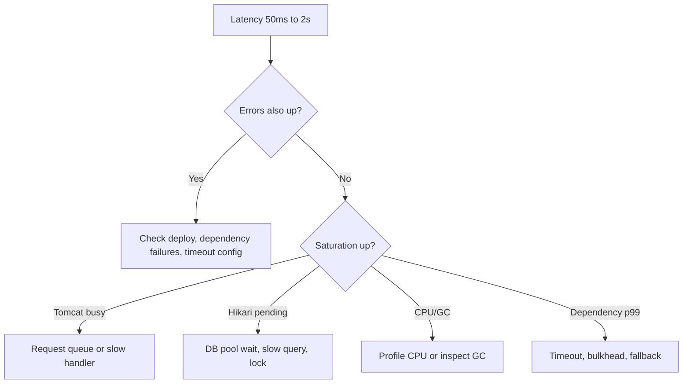

## Interview answer

> If API latency jumps from 50ms to 2 seconds, I first separate user-visible latency from errors and saturation. I check p50, p95, p99, error rate, Tomcat busy threads, Hikari pending connections, dependency latency, JVM GC, CPU, and recent deploys. If pools are exhausted, I capture thread dumps with `jcmd` before restarting so the RCA is based on evidence.

The important point: a 2s response does not always mean the code suddenly became slow.

It often means requests are waiting in a queue:

- Tomcat request queue
- Hikari connection wait
- Redis connection wait
- RestClient socket pool wait
- Kafka reply wait
- synchronized hot section
- database lock
- GC pause

## First 5 minutes checklist

| Minute | Check | What I am looking for |
|---:|---|---|
| 0-1 | p50, p95, p99 by endpoint | All percentiles up means broad slowdown; p99 only means tail, queueing, or a slow dependency. |
| 1-2 | error rate and status mix | 5xx/timeout spike changes mitigation: fail fast, rollback, or dependency isolation. |
| 2-3 | saturation | Tomcat busy threads, Hikari pending, Redis pool, CPU, GC, Kafka lag. |
| 3-4 | recent deploy/config/traffic | New version, feature flag, DB migration, campaign traffic, cache flush. |
| 4-5 | dependency latency | RestClient timers, DB query time, Redis command latency, Kafka request/reply waits. |

## Dashboard panels I want

```text
API
  http.server.requests p50/p95/p99 by uri and status
  request rate by uri
  errors by exception

Saturation
  tomcat.threads.busy / tomcat.threads.current
  hikaricp.connections.active / pending / timeout
  JVM CPU, heap, gc pause

Dependencies
  http.client.requests p95/p99 by host
  jdbc query latency
  redis command latency and timeouts
  kafka consumer lag and producer send latency
```

## Instrument the controller

Use Micrometer timers for the business operation, not only the HTTP endpoint.

```java
package com.example.payment;

import io.micrometer.core.annotation.Timed;
import io.micrometer.observation.annotation.Observed;
import org.springframework.http.ResponseEntity;
import org.springframework.web.bind.annotation.*;

@RestController
@RequestMapping("/api/payments")
class PaymentController {
    private final PaymentService paymentService;

    PaymentController(PaymentService paymentService) {
        this.paymentService = paymentService;
    }

    @Timed(value = "payment.authorize.controller", histogram = true)
    @Observed(name = "payment.authorize", contextualName = "authorize payment")
    @PostMapping("/{paymentId}/authorize")
    ResponseEntity<PaymentResponse> authorize(@PathVariable String paymentId,
                                              @RequestBody PaymentRequest request) {
        PaymentResponse response = paymentService.authorize(paymentId, request);
        return ResponseEntity.ok(response);
    }
}
```

This lets you compare:

- HTTP server latency
- controller/business latency
- downstream client latency
- JDBC latency

If HTTP latency is high but business timer is low, suspect request queueing before controller execution.

## Instrument RestClient dependency calls

In Spring Boot 3.x, Micrometer Observation can tag outbound calls. Keep timeouts explicit.

```java
package com.example.payment;

import io.micrometer.observation.ObservationRegistry;
import org.springframework.boot.web.client.ClientHttpRequestFactories;
import org.springframework.boot.web.client.ClientHttpRequestFactorySettings;
import org.springframework.context.annotation.Bean;
import org.springframework.context.annotation.Configuration;
import org.springframework.web.client.RestClient;

import java.time.Duration;

@Configuration
class FraudClientConfig {
    @Bean
    RestClient fraudRestClient(RestClient.Builder builder, ObservationRegistry registry) {
        var settings = ClientHttpRequestFactorySettings.DEFAULTS
                .withConnectTimeout(Duration.ofMillis(300))
                .withReadTimeout(Duration.ofMillis(800));

        return builder
                .baseUrl("https://fraud.internal")
                .observationRegistry(registry)
                .requestFactory(ClientHttpRequestFactories.get(settings))
                .build();
    }
}
```

```java
package com.example.payment;

import org.springframework.stereotype.Component;
import org.springframework.web.client.RestClient;

@Component
class FraudClient {
    private final RestClient fraudRestClient;

    FraudClient(RestClient fraudRestClient) {
        this.fraudRestClient = fraudRestClient;
    }

    FraudDecision score(PaymentRequest request) {
        return fraudRestClient.post()
                .uri("/v1/score")
                .body(request)
                .retrieve()
                .body(FraudDecision.class);
    }
}
```

If `http.client.requests{client.name="fraud.internal"}` moves from 20ms to 1800ms, the API latency is downstream-driven.

## Time the service and JDBC section

```java
package com.example.payment;

import io.micrometer.core.instrument.MeterRegistry;
import io.micrometer.core.instrument.Timer;
import org.springframework.jdbc.core.simple.JdbcClient;
import org.springframework.stereotype.Repository;

@Repository
class PaymentRepository {
    private final JdbcClient jdbcClient;
    private final Timer findPaymentTimer;

    PaymentRepository(JdbcClient jdbcClient, MeterRegistry registry) {
        this.jdbcClient = jdbcClient;
        this.findPaymentTimer = Timer.builder("payment.jdbc.find")
                .description("Payment lookup latency")
                .publishPercentileHistogram()
                .register(registry);
    }

    PaymentRecord findForUpdate(String paymentId) {
        return findPaymentTimer.record(() ->
                jdbcClient.sql("""
                        select id, status, amount
                        from payments
                        where id = :id
                        for update
                        """)
                        .param("id", paymentId)
                        .query(PaymentRecord.class)
                        .single()
        );
    }
}
```

If `payment.jdbc.find` is slow and Hikari active is high, check DB locks or query plan.

If `payment.jdbc.find` is normal but `hikaricp.connections.pending` is high, requests are waiting for a connection before the query starts.

## HikariCP symptoms

```yaml
spring:
  datasource:
    hikari:
      maximum-pool-size: 30
      connection-timeout: 500ms
      leak-detection-threshold: 2000ms
      validation-timeout: 250ms
```

| Symptom | Meaning |
|---|---|
| `hikaricp.connections.pending` rising | Threads are waiting for DB connections. |
| `hikaricp.connections.active` near max | Pool is saturated or connections are held too long. |
| `hikaricp.connections.timeout` increasing | Requests cannot get a connection within `connectionTimeout`. |
| Leak detection log | Code borrowed a connection and did not return it fast enough. |

Do not blindly increase `maximumPoolSize`.

If the database can safely handle 80 concurrent queries and you run 4 pods, a pool of 50 per pod creates 200 possible concurrent DB queries and can make latency worse.

## Capture thread dumps when pools are exhausted

On the pod:

```bash
jcmd 1 Thread.print -l > /tmp/threads-$(date +%s).txt
jcmd 1 VM.native_memory summary > /tmp/native-memory.txt
jcmd 1 GC.heap_info > /tmp/heap-info.txt
```

Take three dumps 10 seconds apart:

```bash
for i in 1 2 3; do
  jcmd 1 Thread.print -l > "/tmp/threads-$i.txt"
  sleep 10
done
```

What I look for:

- many `http-nio-*` threads waiting in `HikariPool.getConnection`
- many threads blocked on the same `synchronized` monitor
- RestClient threads stuck in socket read
- `CompletableFuture.get()` or `CountDownLatch.await()` without a deadline
- Kafka request/reply waits on request threads

## Kafka lag causing sync wait

This is a common anti-pattern.

```java
package com.example.payment;

import org.springframework.kafka.core.KafkaTemplate;
import org.springframework.stereotype.Service;

import java.time.Duration;

@Service
class BadPaymentService {
    private final KafkaTemplate<String, PaymentCommand> kafkaTemplate;
    private final PaymentStatusWaiter waiter;

    BadPaymentService(KafkaTemplate<String, PaymentCommand> kafkaTemplate,
                      PaymentStatusWaiter waiter) {
        this.kafkaTemplate = kafkaTemplate;
        this.waiter = waiter;
    }

    PaymentResponse authorize(String paymentId, PaymentRequest request) {
        kafkaTemplate.send("payment-authorize", paymentId, new PaymentCommand(paymentId, request));

        // Anti-pattern: API latency now depends on consumer lag and broker health.
        PaymentStatus status = waiter.waitForStatus(paymentId, Duration.ofSeconds(2));
        return new PaymentResponse(paymentId, status);
    }
}
```

Better:

```java
@Service
class AcceptedPaymentService {
    private final KafkaTemplate<String, PaymentCommand> kafkaTemplate;

    AcceptedPaymentService(KafkaTemplate<String, PaymentCommand> kafkaTemplate) {
        this.kafkaTemplate = kafkaTemplate;
    }

    PaymentAcceptedResponse authorize(String paymentId, PaymentRequest request) {
        kafkaTemplate.send("payment-authorize", paymentId, new PaymentCommand(paymentId, request));
        return new PaymentAcceptedResponse(paymentId, "ACCEPTED");
    }
}
```

Return `202 Accepted`, expose polling/webhook/status API, and keep the request path independent from consumer lag.

## Practical decision tree



## Concrete RCA table

| Symptom | Check | Spring fix |
|---|---|---|
| p99 high, p50 normal | Thread dump, Tomcat busy threads | Add timeout, bulkhead, remove long tail dependency from hot path. |
| p50 and p99 high | CPU, DB, Redis, dependency p50 | Find shared bottleneck; rollback or scale the bottleneck layer. |
| `hikaricp.connections.pending` high | Pool active, DB active sessions, query duration | Shorten transactions, add index, reduce Tomcat concurrency, tune pool by DB capacity. |
| Hikari leak logs | Stack in leak log, transaction boundaries | Close resources, remove slow remote calls inside DB transaction. |
| RestClient p99 high | `http.client.requests` by host | Set connect/read timeout, Resilience4j timeout/retry/bulkhead, degrade non-critical call. |
| Kafka lag high and API slow | Request threads waiting for Kafka completion | Return 202 and decouple with status API; do not synchronously wait on consumer. |
| GC pause high | `jvm.gc.pause`, heap occupancy, allocation profile | Reduce allocation, tune heap percentage, inspect object churn, check cache size. |
| CPU high | async-profiler/JFR, top stack | Optimize hot loop, remove lock, cache expensive computation. |
| Redis timeout | Redis latency, connection pool, key hotness | Add local cache, shard hot key, timeout/fallback, avoid large values. |
| Recent deploy matches spike | Diff, feature flag, canary metrics | Roll back, disable flag, add regression metric/test. |

## The mitigation answer

In an incident I do not wait for perfect RCA before reducing impact.

Practical mitigations:

- roll back the deploy if correlation is strong
- lower read timeouts to fail fast
- disable optional dependency calls
- shed non-critical endpoints
- increase pods only if dependencies have capacity
- temporarily increase Hikari only if database concurrency allows it
- warm cache if cache flush caused DB overload
- pause Kafka consumers if downstream writes are overloaded

## Final interview close

> I would not guess. I would prove where the 2 seconds are spent by comparing HTTP timers, dependency timers, pool saturation, GC, CPU, and thread dumps. The RCA should say exactly which queue or dependency caused the latency, what Spring configuration or code path amplified it, and what guardrail prevents recurrence.
