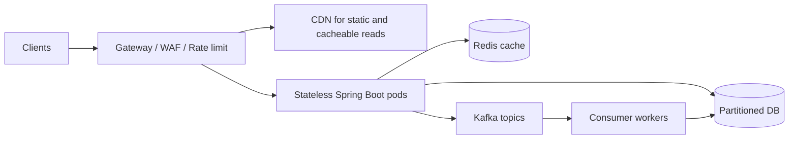

## Interview answer

> I would not start with "add servers." I would calculate one pod's safe throughput, remove state from the API tier, protect downstreams with backpressure, cache the read path, partition and batch the write path, and offload slow work to Kafka. At 1M RPS the real problem is controlling concurrency into databases and dependencies, not just running more Spring Boot pods.

The practical shape:

```text
Gateway rate limits
  -> stateless Spring Boot API pods
  -> Redis/CDN for read-heavy data
  -> Kafka for async heavy work
  -> partitioned databases and consumers
  -> autoscaling on RPS, CPU, latency, and queue depth
```

## Capacity math for one Spring Boot pod

For blocking Spring MVC on Tomcat:

```text
RPS ~= concurrent request threads / average service time in seconds
```

Example:

```text
Tomcat maxThreads = 200
Average latency   = 50ms = 0.05s
Theoretical RPS   = 200 / 0.05 = 4,000 RPS
Practical target  = 50-70% of that after CPU, GC, downstream, and tail latency
Safe pod target   = 2,000-2,800 RPS
```

If latency becomes 200ms:

```text
200 / 0.20 = 1,000 RPS theoretical
```

So throughput collapses when dependencies slow down.

That is why low latency is capacity.

## Pod estimate

If one pod safely handles 2,500 RPS:

```text
1,000,000 RPS / 2,500 RPS per pod = 400 pods
```

Then check whether downstreams can handle:

- DB connections from 400 pods
- Redis connections and hot keys
- Kafka producer throughput
- network egress
- TLS termination
- logs and metrics volume

If each pod has Hikari max pool 30:

```text
400 pods * 30 connections = 12,000 database connections
```

That is usually not acceptable.

So you must gate database concurrency, cache reads, partition writes, and reduce sync dependencies.

## Horizontal scale: sticky vs stateless

Stateless API pods are the default.

Do:

- keep sessions in JWT, Redis, or an identity provider
- keep idempotency keys in Redis/DB
- store uploads in object storage
- use distributed locks only for narrow critical sections
- route by any pod for normal REST calls

Avoid sticky sessions unless there is a strong reason.

Sticky sessions create:

- uneven load
- bad failover
- hot pods
- harder autoscaling

If WebSocket or long polling requires affinity, isolate that workload from the normal API tier.

## High-level scaling architecture



## Read path: Redis and CDN

For product catalog, feature flags, public profiles, pricing snapshots, and eligibility data:

- CDN for public HTTP cacheable responses
- Redis for app-level objects
- local Caffeine for tiny hot reference data
- TTL and versioned keys
- negative caching for not-found data when safe

Example read-through-ish cache-aside:

```java
package com.example.catalog;

import org.springframework.cache.annotation.Cacheable;
import org.springframework.stereotype.Service;

@Service
class ProductQueryService {
    private final ProductRepository repository;

    ProductQueryService(ProductRepository repository) {
        this.repository = repository;
    }

    @Cacheable(cacheNames = "product-v3", key = "#productId", unless = "#result == null")
    ProductView getProduct(String productId) {
        return repository.findVisibleProduct(productId);
    }
}
```

At 1M RPS, a 95% cache hit ratio changes DB load dramatically:

```text
1,000,000 RPS * 5% misses = 50,000 DB-backed reads/sec
```

That may still be too high, so you also need:

- CDN for public reads
- denormalized read models
- partitioning by tenant/product/category
- precomputed responses

## Write path: partitioning and batching

Writes do not scale like reads.

Use:

- partition key such as tenant ID, customer ID, merchant ID, or order ID
- idempotency key for retries
- Kafka topic partitioning by aggregate ID
- batch writes in consumers
- compact events where safe
- avoid global counters in the hot path

Example request accepted and written asynchronously:

```java
package com.example.order;

import org.springframework.http.HttpStatus;
import org.springframework.http.ResponseEntity;
import org.springframework.kafka.core.KafkaTemplate;
import org.springframework.web.bind.annotation.*;

@RestController
@RequestMapping("/api/orders")
class OrderCommandController {
    private final KafkaTemplate<String, OrderCommand> kafkaTemplate;

    OrderCommandController(KafkaTemplate<String, OrderCommand> kafkaTemplate) {
        this.kafkaTemplate = kafkaTemplate;
    }

    @PostMapping
    ResponseEntity<OrderAccepted> create(@RequestHeader("Idempotency-Key") String idempotencyKey,
                                         @RequestBody CreateOrderRequest request) {
        String orderId = OrderIds.newId();
        OrderCommand command = new OrderCommand(orderId, idempotencyKey, request);

        kafkaTemplate.send("order-create-v1", orderId, command);

        return ResponseEntity.status(HttpStatus.ACCEPTED)
                .body(new OrderAccepted(orderId, "ACCEPTED"));
    }
}
```

The API gives a fast answer, and consumers own heavier validation, enrichment, persistence, and notification.

## Async offload with `@Async`

Use this for small internal async work, not durable business commands.

```java
package com.example.notifications;

import org.springframework.context.annotation.Bean;
import org.springframework.context.annotation.Configuration;
import org.springframework.core.task.TaskExecutor;
import org.springframework.scheduling.annotation.Async;
import org.springframework.scheduling.concurrent.ThreadPoolTaskExecutor;
import org.springframework.stereotype.Service;

@Configuration
class AsyncConfig {
    @Bean
    TaskExecutor notificationExecutor() {
        ThreadPoolTaskExecutor executor = new ThreadPoolTaskExecutor();
        executor.setThreadNamePrefix("notification-");
        executor.setCorePoolSize(16);
        executor.setMaxPoolSize(32);
        executor.setQueueCapacity(2_000);
        executor.initialize();
        return executor;
    }
}

@Service
class NotificationService {
    @Async("notificationExecutor")
    void sendReceipt(String orderId) {
        // Email/SMS should not hold the checkout request thread.
    }
}
```

If work must survive pod restart, use Kafka/outbox instead of only `@Async`.

## Spring MVC vs WebFlux

Use Spring MVC when:

- codebase is mostly blocking JDBC/Redis/RestClient
- team understands thread-per-request operations
- DB pool is the bottleneck
- traffic is moderate and latency is low

Use WebFlux when:

- most time is remote I/O
- dependencies have reactive clients
- you handle many concurrent slow sockets
- backpressure is part of the stream model

Do not use WebFlux to hide slow database calls.

If you call blocking JDBC from WebFlux event loops, you can make the service worse.

## Gateway rate limit

At 1M RPS, the gateway protects everything behind it.

Example policy:

```yaml
routes:
  - id: checkout-api
    path: /api/checkout/**
    rateLimit:
      key: customerId
      replenishRate: 100
      burstCapacity: 200
  - id: catalog-api
    path: /api/catalog/**
    rateLimit:
      key: ip
      replenishRate: 1000
      burstCapacity: 5000
```

The interview point is priority:

- payment/checkout gets stronger protection
- anonymous browse traffic gets tighter shedding
- known abusive tenants get lower limits

## HPA signals

Autoscaling only on CPU is often late.

Better signals:

| Signal | Why it matters |
|---|---|
| RPS per pod | Direct traffic pressure. |
| p95/p99 latency | User impact and queueing. |
| CPU | Compute saturation. |
| Tomcat busy threads | Request concurrency saturation. |
| Executor queue depth | Async backlog before timeouts. |
| Kafka consumer lag | Worker fleet is behind. |
| Hikari pending | DB pool contention; do not blindly scale API pods. |

Example HPA intent:

```yaml
apiVersion: autoscaling/v2
kind: HorizontalPodAutoscaler
metadata:
  name: checkout-api
spec:
  minReplicas: 20
  maxReplicas: 500
  metrics:
    - type: Pods
      pods:
        metric:
          name: http_server_requests_per_second
        target:
          type: AverageValue
          averageValue: "2500"
    - type: Resource
      resource:
        name: cpu
        target:
          type: Utilization
          averageUtilization: 65
```

## Spring Boot concurrency configuration

```yaml
server:
  tomcat:
    threads:
      max: 200
      min-spare: 20
    accept-count: 100

spring:
  datasource:
    hikari:
      maximum-pool-size: 20
      connection-timeout: 500ms
```

Align these numbers.

If Tomcat allows 400 busy request threads but Hikari only has 20 connections, the other 380 requests can pile up waiting for DB.

Sometimes the right fix is lower Tomcat concurrency plus fast failure.

## Practical 10K to 1M sequence

1. Measure current p50/p99, CPU, pool usage, DB QPS, cache hit ratio.
2. Remove server-side session state.
3. Add idempotency and safe retries.
4. Add Redis/CDN for hot reads.
5. Move slow side effects to Kafka.
6. Partition Kafka topics and write models by stable key.
7. Batch consumers and tune poll/commit behavior.
8. Add gateway rate limits by tenant/user/IP.
9. Autoscale API and worker fleets on separate signals.
10. Add load shedding before queues become unbounded.

## What I would say in the interview

> With 200 Tomcat threads and 50ms latency, one pod has a theoretical ceiling near 4K RPS, but I would run it lower to protect p99 and downstreams. To reach 1M RPS, I would need hundreds of stateless pods, but I would not let each pod open large DB pools. I would use Redis/CDN for reads, Kafka for async writes, partitioned storage, gateway rate limits, HPA on RPS/CPU/queue depth, and load shedding for non-critical traffic.

That answer shows both math and production guardrails.
