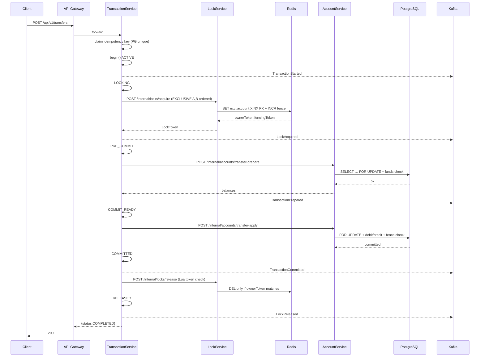
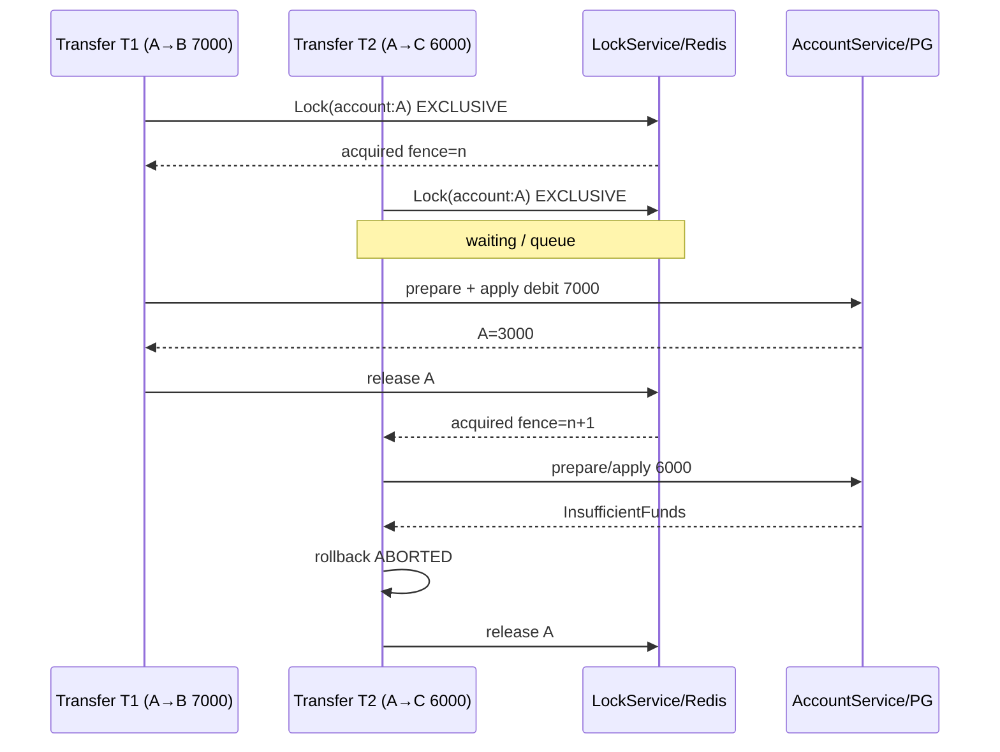
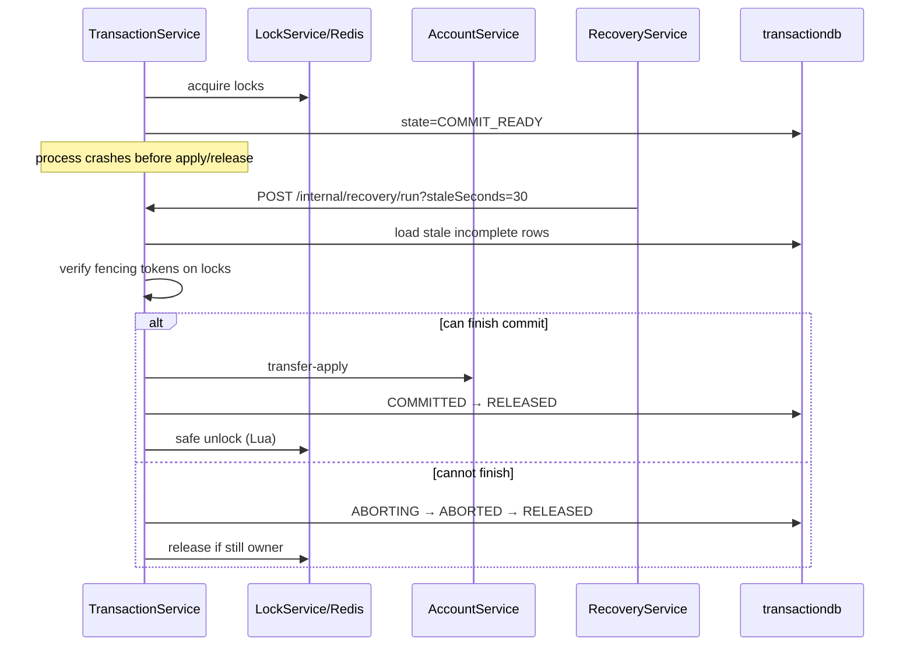
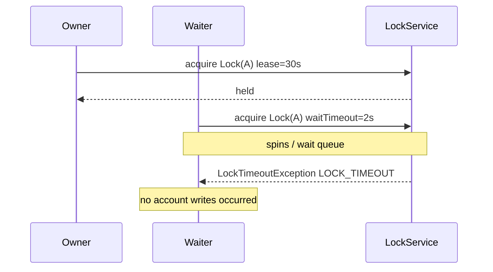
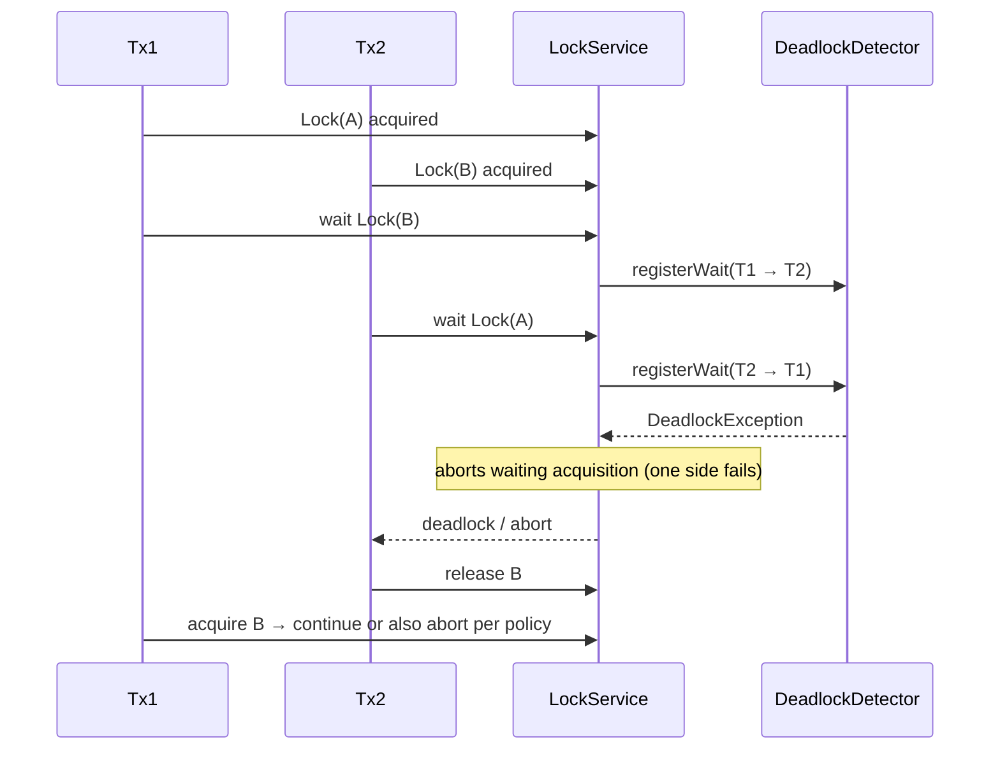
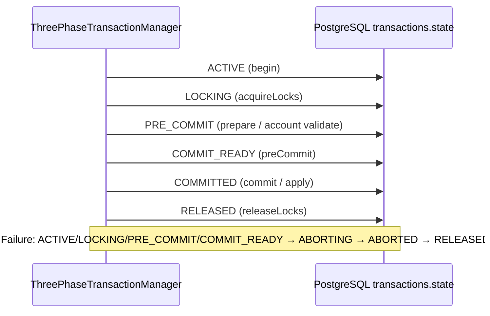
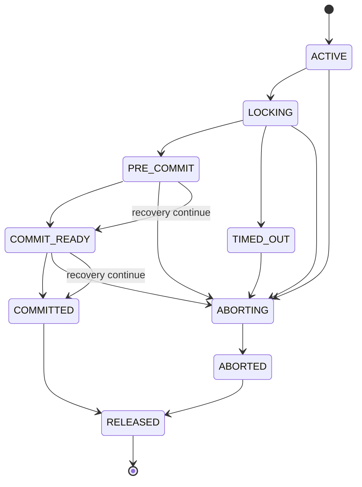

# Distributed 2PL / 3PL Money Transfer

Runnable Spring Boot multi-module system: Redis distributed locks (strict 2PL) + PostgreSQL `SELECT … FOR UPDATE` + persisted 3PL state machine + Kafka lifecycle events + recovery.

## Architecture

```
Client → API Gateway (:8080)
       → Transaction Service (:8083)
           → Lock Service (:8081) → Redis
           → Account Service (:8082) → PostgreSQL (accountdb)
           → PostgreSQL (transactiondb)
           → Kafka (async lifecycle only)
Recovery Service (:8084) polls incomplete 3PL states
```

## Prerequisites

- Java 21
- Maven 3.9+
- Docker + Docker Compose

## Build

```bash
cd distributed-locking
mvn clean install
```

## Start infrastructure

```bash
docker compose up -d
```

Waits for PostgreSQL (`accountdb`, `transactiondb`), Redis, Kafka, Prometheus (`:9090`), Grafana (`:3001`, admin/admin).

## Start services

```bash
chmod +x scripts/*.sh
./scripts/start-services.sh
```

Or manually (separate terminals):

```bash
java -jar lock-service/target/lock-service-1.0.0-SNAPSHOT.jar
java -jar account-service/target/account-service-1.0.0-SNAPSHOT.jar
java -jar transaction-service/target/transaction-service-1.0.0-SNAPSHOT.jar
java -jar recovery-service/target/recovery-service-1.0.0-SNAPSHOT.jar
java -jar api-gateway/target/api-gateway-1.0.0-SNAPSHOT.jar
```

Health:

```bash
curl -s http://localhost:8081/actuator/health
curl -s http://localhost:8082/actuator/health
curl -s http://localhost:8083/actuator/health
curl -s http://localhost:8084/actuator/health
curl -s http://localhost:8080/actuator/health
```

## Create accounts

```bash
curl -s -X POST http://localhost:8080/api/v1/accounts \
  -H 'Content-Type: application/json' \
  -d '{"accountId":"A","initialBalance":10000}'

curl -s -X POST http://localhost:8080/api/v1/accounts \
  -H 'Content-Type: application/json' \
  -d '{"accountId":"B","initialBalance":5000}'

curl -s -X POST http://localhost:8080/api/v1/accounts \
  -H 'Content-Type: application/json' \
  -d '{"accountId":"C","initialBalance":2000}'
```

## Execute transfer

```bash
curl -s -X POST http://localhost:8080/api/v1/transfers \
  -H 'Content-Type: application/json' \
  -H 'Idempotency-Key: demo-1' \
  -d '{
    "sourceAccountId":"A",
    "destinationAccountId":"B",
    "amount":7000,
    "idempotencyKey":"demo-1"
  }'
```

Expected:

```json
{"transactionId":"...","status":"COMPLETED"}
```

```bash
curl -s http://localhost:8080/api/v1/accounts/A
curl -s http://localhost:8080/api/v1/transfers/<transactionId>
```

## Concurrent scenario (A=10000; T1 A→B 7000 & T2 A→C 6000)

```bash
./scripts/test-transfer.sh
```

Only one depleting transfer can succeed. Final A is `3000` or `4000`. Never negative.

## Idempotency

Same `Idempotency-Key` returns the original result; unique constraint in PostgreSQL prevents double execution.

## Simulate failure / recovery

1. Start a transfer, kill `transaction-service` mid-flight (leave Redis lease / DB row in `PRE_COMMIT` or `COMMIT_READY`).
2. Wait for lease/stale window (`RECOVERY_STALE_SECONDS`, default 30s).
3. Trigger recovery:

```bash
curl -s -X POST http://localhost:8080/api/v1/recovery/run
```

Recovery continues commit when balances were prepared for commit, otherwise aborts and releases Redis locks. Fencing tokens reject stale writers after lease expiry.

## Metrics

- `distributed_lock_acquisition_total`
- `distributed_lock_timeout_total`
- `distributed_lock_wait_seconds`
- `distributed_deadlock_total`
- `transaction_success_total`
- `transaction_failure_total`
- `transaction_rollback_total`
- `transaction_recovery_total`

Prometheus scrapes actuators via `observability/prometheus.yml`.

---

## Sequence diagrams (match implemented code)

### 1 — Successful transfer



### 2 — Concurrent transfers (insufficient combined funds)



### 3 — Application crash + recovery



### 4 — Lock timeout



### 5 — Deadlock detection



### 6 — 3PL state transitions



### State diagram



## Modules

| Module | Port | Role |
|--------|------|------|
| `api-gateway` | 8080 | Edge routes |
| `lock-service` | 8081 | Redis 2PL locks, fencing, deadlock wait-for graph |
| `account-service` | 8082 | Ledger + `FOR UPDATE` + fence validation |
| `transaction-service` | 8083 | 2PL/3PL coordinator, idempotency, Kafka producer |
| `recovery-service` | 8084 | Stale txn recovery + Kafka consumer/DLQ |
| `common` | — | DTOs / events / exceptions |

## Tests

```bash
mvn test
```

Redis/Testcontainers integration tests skip when Docker is unavailable. End-to-end concurrency is covered by `scripts/test-transfer.sh` against a running stack.
