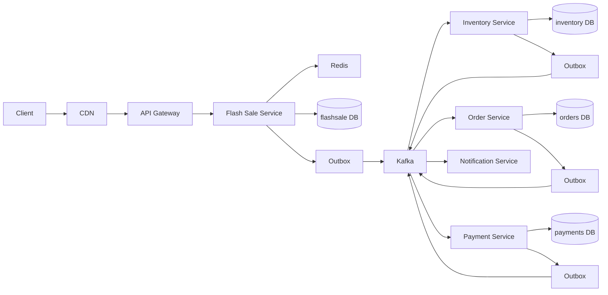

# Architecture — Flash Sale Platform

Interview one-liner: **Redis sheds 99% of losing requests. PostgreSQL is the only inventory authority. Kafka + outbox +
saga + idempotency give effectively-once business semantics. Spring Security never talks to Kafka.**

## Why this shape

A flash sale is not “an e-commerce checkout with more RAM.”

| Constraint                       | Implication                                                                                       |
|----------------------------------|---------------------------------------------------------------------------------------------------|
| 500K–1M HTTP RPS, 10,000 units   | Almost every request must die in memory / Redis. The DB cannot see them.                          |
| Never oversell                   | The decrement must be a single atomic compare-and-swap in PostgreSQL. Redis is a gate, not truth. |
| Payment can fail after reserve   | Saga compensation, not 2PC.                                                                       |
| Duplicate HTTP + duplicate Kafka | Unique constraints + idempotency keys. Application `if` checks are not enough.                    |
| Dual-write (DB + Kafka)          | Transactional outbox. Never `save()` then `kafkaTemplate.send()` in two commits.                  |

## Logical architecture



## Sync vs async (the most important cut)

**Synchronous path (must stay under ~100ms p95):**

```text
Gateway → JWT → rate limit → sale state → idempotency → Redis gate → outbox insert → 202 PENDING
```

**Asynchronous path (correctness):**

```text
OrderRequested → Inventory atomic reserve → InventoryReserved
  → Order create + saga → PaymentRequested
  → Payment → PaymentSucceeded/Failed
  → Confirm or compensate (release + cancel)
```

If you fold payment into the HTTP request you will either time out the user or hold a DB transaction across a network
call. Both fail an architect interview.

## Ownership (database-per-service)

| Service              | Owns                                                                 | Does not own                |
|----------------------|----------------------------------------------------------------------|-----------------------------|
| flash-sale-service   | Sale catalog, schedule, idempotency of *purchase intent*, Redis gate | Reservations, orders, money |
| inventory-service    | Stock, reservations, release                                         | Orders, payments            |
| order-service        | Orders, saga state                                                   | Stock, card charges         |
| payment-service      | Payment attempts                                                     | Inventory                   |
| notification-service | Delivery of already-decided events                                   | Business state              |
| api-gateway          | Authn/z at the edge, coarse rate limit, routing                      | Domain writes               |

No shared tables. If you need another service’s data, you consume its events or call its API. Cross-DB foreign keys are
forbidden.

## Three inventory layers (say this)

1. **Redis Lua `DECRBY` if stock ≥ qty** — load-shed. If Redis says 0, return `PRODUCT_SOLD_OUT` without Kafka.
2. **PostgreSQL `UPDATE … WHERE available >= qty`** — source of truth. `rowsUpdated == 1` or reject.
3. **`UNIQUE(user_id, flash_sale_id, product_id)` on orders** — last safety net against double purchase.

Remove layer 1 → DB melts. Remove layer 2 → oversell when Redis is wrong. Remove layer 3 → two concurrent HTTP requests
for the same user both “win.”

## What we deliberately did not do

| Tempting idea                               | Why not                                                                                    |
|---------------------------------------------|--------------------------------------------------------------------------------------------|
| Redis as source of truth                    | Crash / flush / replica lag = lost stock or oversell.                                      |
| 2PC across inventory/order/payment DBs      | Coordinator availability becomes the sale.                                                 |
| `synchronized` on a singleton               | One JVM, one replica. Flash sales run on many pods.                                        |
| Choreography-only saga                      | Payment timeout + release + cancel is easier to audit as an orchestrator in order-service. |
| Kafka “exactly-once” as the business answer | EOS is a produce/consume guarantee, not “one order per user.”                              |

## Request ID / correlation

Every HTTP request gets `X-Request-Id` / `X-Correlation-Id` at the gateway. That id is copied onto every `EventEnvelope`
and every log line so a 202 can be traced through Kafka.

See `lld.md` for aggregates, `concurrency.md` for the three lock styles, `outbox.md` and `saga.md` for recovery.
