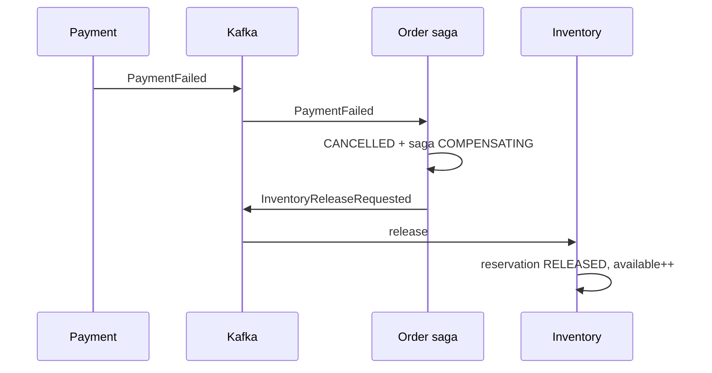
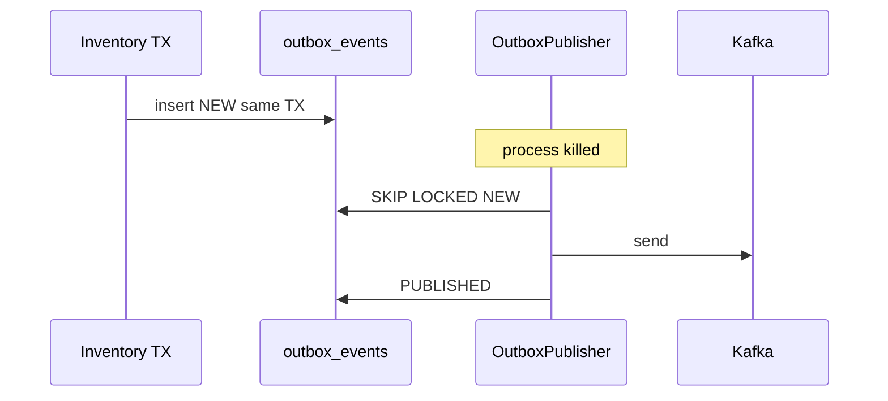

# Failure matrix

| Failure                    | Expected behavior                                                                                                                                |
|----------------------------|--------------------------------------------------------------------------------------------------------------------------------------------------|
| Redis down                 | Purchase path 503. Catalog may hit DB behind bulkhead. No silent bypass of the gate.                                                             |
| Kafka down                 | Outbox stays `NEW`. API still 202 if outbox insert succeeded. Poller retries. If Kafka is down *before* first insert and we cannot persist, 503. |
| DB down                    | Transient retry. Persistent → 503.                                                                                                               |
| Payment timeout            | Retry (idempotent provider key = orderId). Then saga compensate.                                                                                 |
| Payment failure            | `PaymentFailed` → cancel order → release reservation.                                                                                            |
| Duplicate HTTP             | Same idempotency key → original 202 body.                                                                                                        |
| Duplicate Kafka            | `eventId` unique / processed set → no-op.                                                                                                        |
| Consumer crash             | Offset uncommitted → redelivery → idempotent handler.                                                                                            |
| Outbox publisher crash     | `NEW` rows remain; another replica publishes.                                                                                                    |
| Inventory crash            | Event stays in Kafka; lag grows; no lost reserve intent.                                                                                         |
| Order crash                | Same.                                                                                                                                            |
| Redis stale (gate 5, DB 0) | Atomic SQL rejects; Redis INCR not applied (already 0 path) / reject compensates.                                                                |
| Redis stale (gate 0, DB 5) | Shed until reconcilers restock the gate from DB.                                                                                                 |
| DB deadlock                | Bounded retry.                                                                                                                                   |
| Poison message             | DLQ. Replay is idempotent and ADMIN-only.                                                                                                        |
| Kafka rebalance            | In-flight TX must already be committed or rolled back; no ack in the middle.                                                                     |
| Payment provider down      | Circuit open → fail payment → compensate.                                                                                                        |
| Clock skew on sale start   | Sale state from DB `starts_at`, not pod clock alone; NTP assumed. Waiting room uses server time.                                                 |

## Sequence — payment failure

## Sequence — outbox crash

