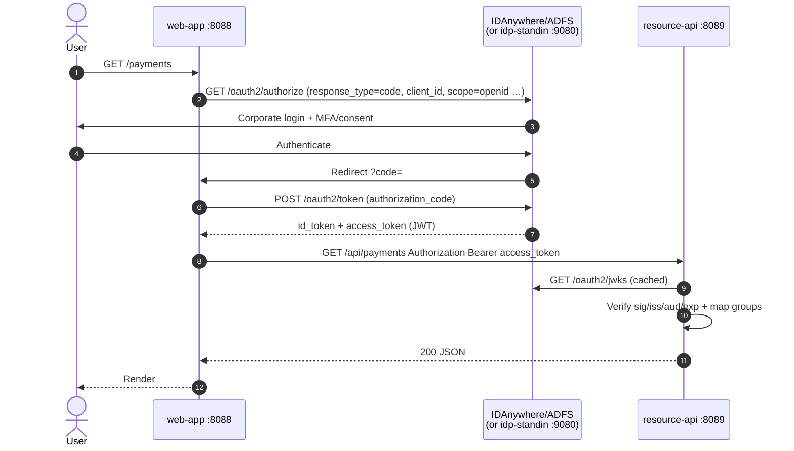
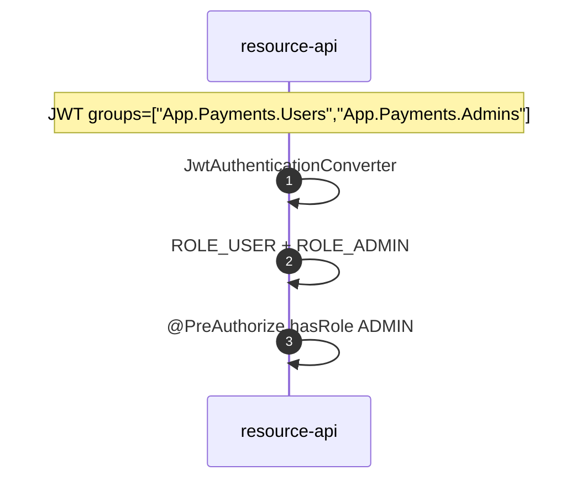

# Flows

## Browser login via IDAnywhere (OIDC + OAuth)

```mermaid
sequenceDiagram
    autonumber
    actor User
    participant App as web-app :8088
    participant IDA as IDAnywhere/ADFS<br/>(or idp-standin :9080)
    participant API as resource-api :8089

    User->>App: GET /payments
    App->>IDA: GET /oauth2/authorize (response_type=code, client_id, scope=openid …)
    IDA->>User: Corporate login + MFA/consent
    User->>IDA: Authenticate
    IDA->>App: Redirect ?code=
    App->>IDA: POST /oauth2/token (authorization_code)
    IDA-->>App: id_token + access_token (JWT)
    App->>API: GET /api/payments Authorization Bearer access_token
    API->>IDA: GET /oauth2/jwks (cached)
    API->>API: Verify sig/iss/aud/exp + map groups
    API-->>App: 200 JSON
    App-->>User: Render
```

## Group claim → Spring role

```mermaid
sequenceDiagram
    autonumber
    participant API as resource-api
    Note over API: JWT groups=["App.Payments.Users","App.Payments.Admins"]
    API->>API: JwtAuthenticationConverter
    API->>API: ROLE_USER + ROLE_ADMIN
    API->>API: @PreAuthorize hasRole ADMIN
```
