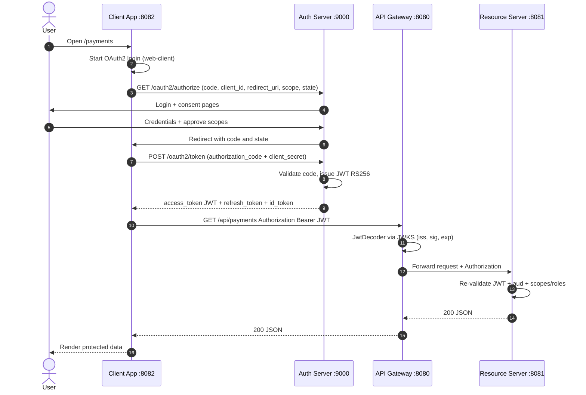
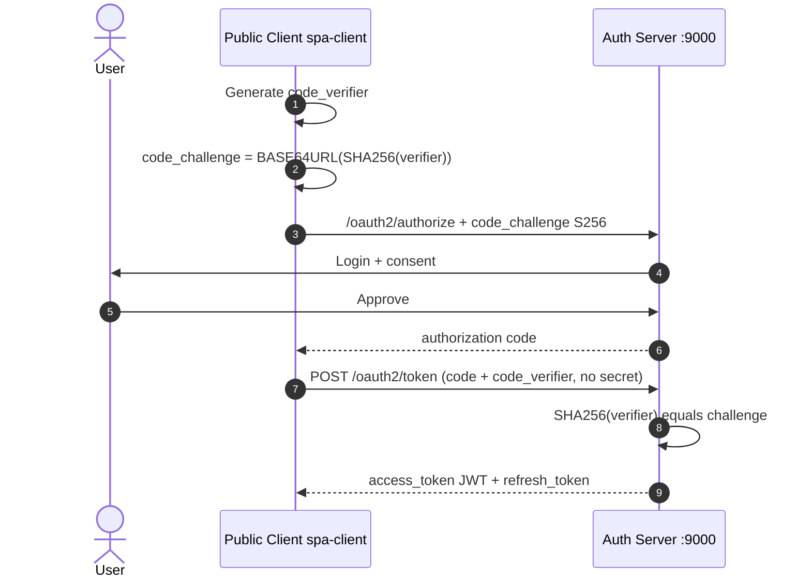
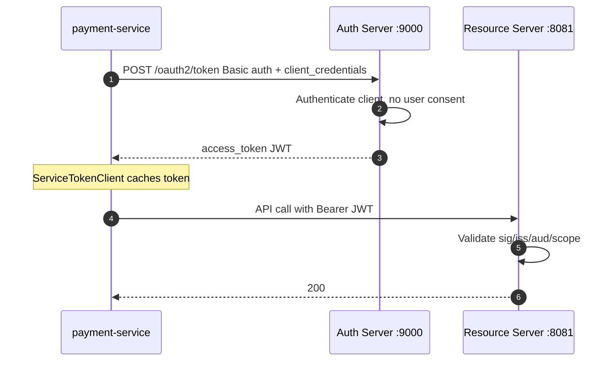
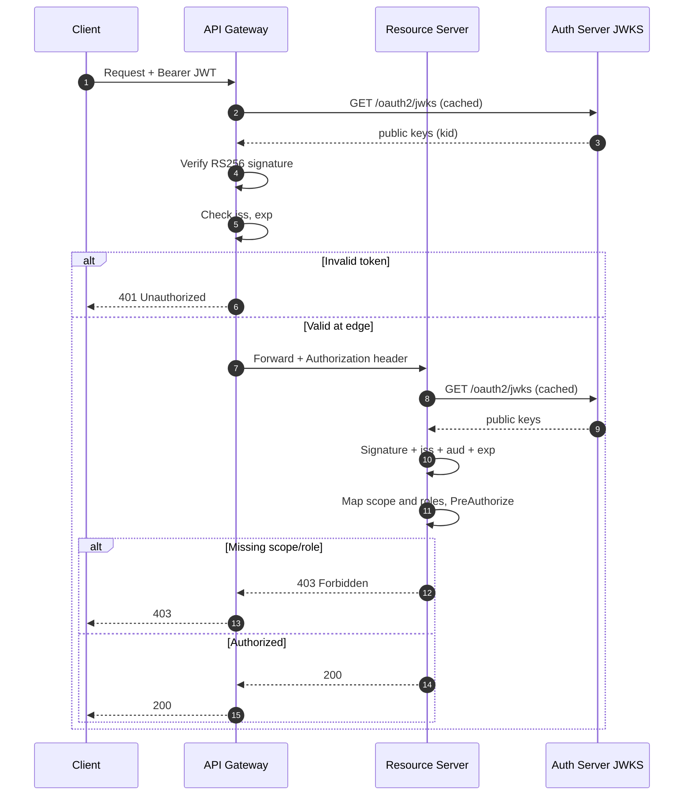
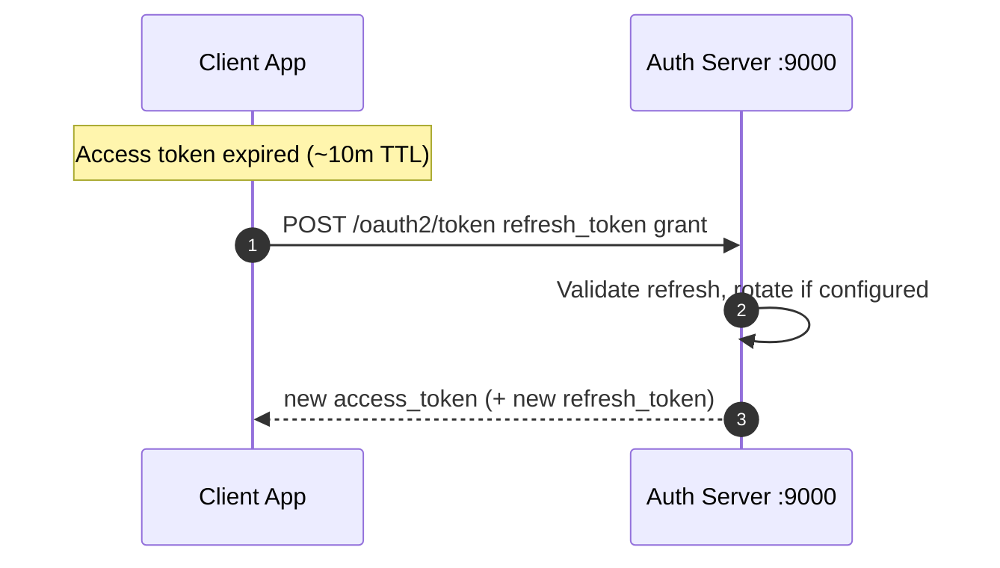

# OAuth Flows

## Authorization Code (+ PKCE)
Browser authorize → login/consent → code → token endpoint → JWT → API.

PKCE: `code_challenge = BASE64URL(SHA256(code_verifier))`. Required for `spa-client`.

### End-to-end (confidential web-client)

### PKCE (public spa-client)

## Client Credentials
Service identity. Cache tokens; serialize refresh (`ServiceTokenClient`).

## JWT validation (Gateway + Resource Server)

## Refresh
`grant_type=refresh_token`. Demo disables refresh reuse (rotation-friendly).

