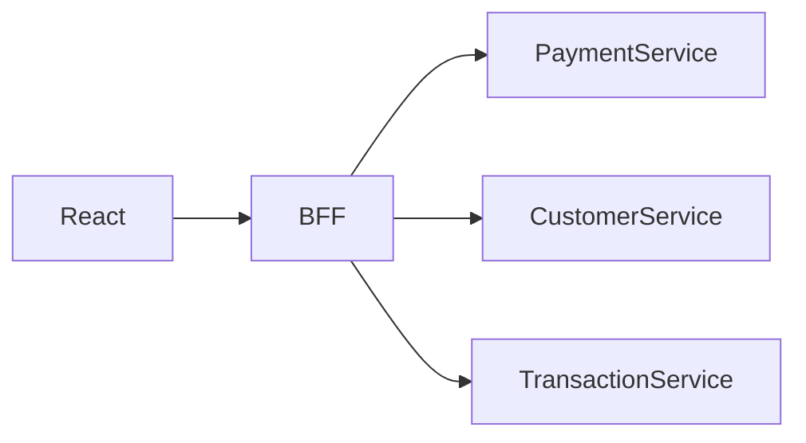

# Architecture — React ↔ Spring Boot ↔ Microservices

## This lab

```text
React SPA (Vite)
  → apiClient
  → Spring Boot monolith BFF-style API (/api/v1)
  → JPA → H2/Postgres
  → SSE payment events
```

## Enterprise shape (say in interview)



Browser must **not** become a service-discovery and orchestration layer across 20 microservices (CORS hell, auth fan-out, chatty mobile networks, inconsistent errors).

## API contract > entities

Frontend depends on DTOs:

```java
public record PaymentResponse(
  String id,
  BigDecimal amount,
  String currency,
  String status,
  Instant createdAt
) {}
```

Never leak JPA entities / lazy proxies over the wire.

## Versioning

```text
/api/v1/payments
/api/v2/payments
```

Prefer additive changes; dual-run; deprecate with sunset headers.

## Real-time

```text
Payment retry
  → status PROCESSING
  → (lab: async delay) SUCCESS
  → PaymentEventPublisher
  → SSE /api/v1/events/payments
  → usePaymentEvents updates UI
```

SSE vs WebSocket: SSE is one-way server→client over HTTP (simpler for status). WebSocket for bidirectional / binary / high-frequency.

## Observability

Propagate `X-Trace-Id` (apiClient). Correlate:

```text
React action → Spring filter → service → SQL
```

Do not log PAN / full card / secrets.

## Slow backend — frontend playbook

Loading + skeleton · cache · pagination · debounce · parallel GETs · prefetch · timeout · retry with jitter · cancel stale · circuit at gateway.
