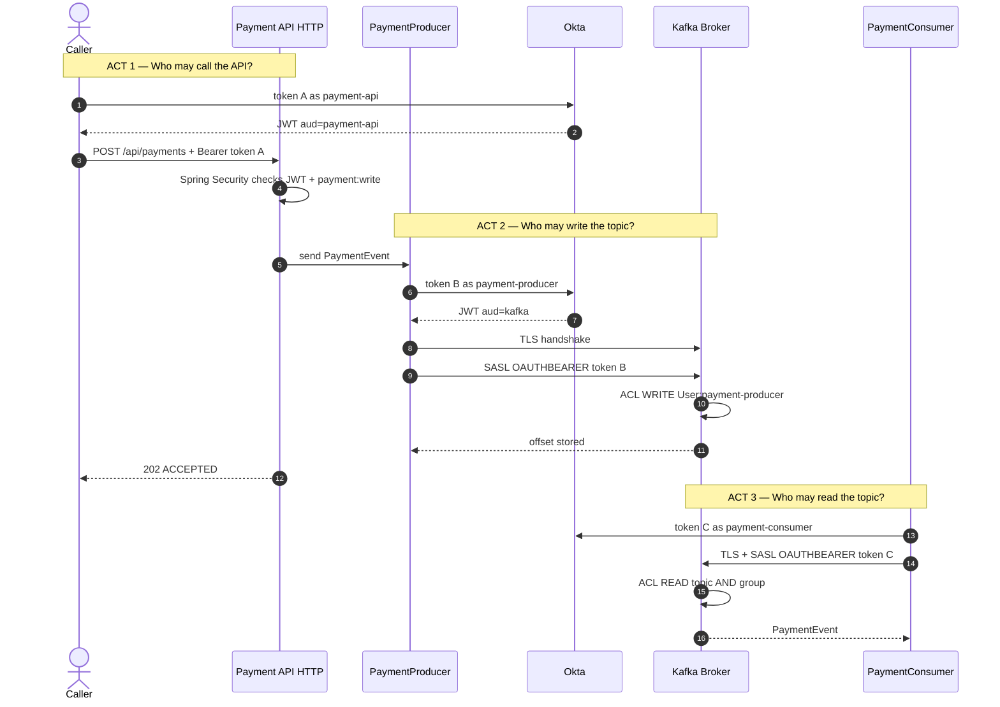

# Secure Kafka — Spring Boot + SASL_SSL + OAuth/OIDC + ACL

Production-shaped lab that applies
the [Spring Security hub](https://vibhuagwl.github.io/vibhu-tech-blog/spring-security/) philosophy to Apache Kafka *
*without treating Kafka as an HTTP resource server**.

| Plane       | Mechanism                                                               | What it answers                                               |
|-------------|-------------------------------------------------------------------------|---------------------------------------------------------------|
| HTTP API    | Spring Security OAuth2 Resource Server (JWKS, issuer, audience, scopes) | Who called `POST /api/payments`? What may they do on the API? |
| Wire        | TLS 1.3 (`SASL_SSL`)                                                    | Is the broker the real broker? Is the payload encrypted?      |
| Kafka authn | SASL/`OAUTHBEARER` + IdP JWT                                            | Who is this producer/consumer?                                |
| Kafka authz | `StandardAuthorizer` ACLs                                               | May `User:payment-producer` WRITE `payments`?                 |

Same IdP. Same JWT vocabulary (`iss`, `aud`, `exp`, JWKS). **Different validation code path.**

---

## 1. Architecture

```text
                    ┌──────────────────────┐
                    │   Identity Provider  │
                    │ Okta OIDC (2 AS)     │
                    └──────────┬───────────┘
                               │
                     client_credentials JWT
                               │
                               ▼
┌─────────────────┐   TLS + SASL/OAUTHBEARER    ┌──────────────────┐
│ Spring Boot     │ ──────────────────────────► │ Kafka (KRaft)    │
│ PaymentProducer │                             │ Authn: JWT+JWKS  │
│ KafkaTemplate   │                             │ Authz: ACL       │
└─────────────────┘                             │ TLS: broker cert │
┌─────────────────┐   TLS + SASL/OAUTHBEARER    │ Inter-broker SASL│
│ PaymentConsumer │ ──────────────────────────► │                  │
│ @KafkaListener  │                             └────────┬─────────┘
└─────────────────┘                                      ▼
REST /api/payments                                  Topic payments
Spring Security RS                                      + payments.DLT
```

Producer and consumer use **different OAuth clients** (`payment-producer` / `payment-consumer`). Least privilege is an
identity choice, not a shared service account.

### Sequence — three questions (interview)

Token A (`aud=payment-api`) is **not** token B (`aud=kafka`). Say the three questions, not every arrow.



Failure layers and extra diagrams: [docs/FLOWS.md](docs/FLOWS.md).

---

## 2. Security model (mapped from the Spring Security article)

Article concepts → Kafka:

| Article                                 | Kafka adaptation                                                                               |
|-----------------------------------------|------------------------------------------------------------------------------------------------|
| Authn vs authz · 401 vs 403             | `SaslAuthenticationException` vs `TopicAuthorizationException` / `GroupAuthorizationException` |
| Resource server validates JWT via JWKS  | Broker `OAuthBearerValidatorCallbackHandler` + `sasl.oauthbearer.jwks.endpoint.url`            |
| Client credentials = machine-to-machine | Kafka clients have no user; they use client credentials                                        |
| Scopes (`payment:write`)                | HTTP `@PreAuthorize`. Kafka uses **ACLs**, not Spring scopes                                   |
| Audience + issuer                       | Broker `expected.audience=kafka`, `expected.issuer=...`                                        |
| Keystore vs truststore                  | Same: identity vs trusted CAs                                                                  |
| Fail closed                             | `allow.everyone.if.no.acl.found=false`                                                         |
| Actuator: health only                   | `/actuator/health` permitAll; everything else JWT                                              |
| CSRF off for Bearer APIs                | Stateless resource server — CSRF disabled                                                      |
| Defense in depth                        | TLS **and** SASL **and** ACL **and** HTTP JWT                                                  |
| Observability                           | `KAFKA_SECURITY_DENIED` audit lines                                                            |

**Do not** put `oauth2ResourceServer()` on the Kafka client. Spring Security never sees the produce/consume SASL
handshake.

### SASL mechanisms — when to use which

| Mechanism                    | Use                                                                                                  |
|------------------------------|------------------------------------------------------------------------------------------------------|
| `SSL` only (mTLS)            | Strong identity from certs; no IdP. Painful rotation at scale.                                       |
| `SASL_PLAINTEXT` + PLAIN     | Lab only. Password on an unencrypted socket.                                                         |
| `SASL_SSL` + PLAIN           | Simple username/password over TLS. Fine for small clusters; secrets live on every client.            |
| `SASL_SSL` + SCRAM-SHA-512   | Broker-stored salted hashes. Good when you have no IdP.                                              |
| **`SASL_SSL` + OAUTHBEARER** | **This lab / production default.** Short-lived JWTs, central revocation, one IdP with the HTTP APIs. |

---

## 3. Project structure

```text
secure-kafka/
├── src/main/java/com/example/kafka/
│   ├── config/          KafkaProducerConfig, KafkaConsumerConfig, KafkaSecurityConfig, SecurityConfig
│   ├── producer/        PaymentProducer
│   ├── consumer/        PaymentConsumer
│   ├── security/        Kafka OAuth callback + HTTP 401/403 JSON
│   ├── model/           PaymentEvent
│   └── controller/      PaymentController
├── src/main/resources/application.yml
├── docker/              docker-compose.yml, kafka/
├── certificates/        generated PKCS12 (gitignored)
├── scripts/             certs, topics, ACLs, token, start
├── docs/OKTA.md         Okta authorization servers + apps
├── docs/FLOWS.md        sequence diagrams
└── pom.xml
```

---

## 4. Maven

Java 21 · Spring Boot 3.4.5 · Spring Security 6 · Spring Kafka 3.3 · Kafka clients 3.9.

```bash
./mvnw -q test
# or
mvn -q test
```

---

## 5. Kafka broker (KRaft)

`docker/kafka/server.properties` is current Kafka (no ZooKeeper). Important lines:

```properties
listeners=SASL_SSL://0.0.0.0:9093,CONTROLLER://0.0.0.0:9094
listener.security.protocol.map=SASL_SSL:SASL_SSL,CONTROLLER:SASL_SSL
inter.broker.listener.name=SASL_SSL
sasl.enabled.mechanisms=OAUTHBEARER
sasl.mechanism.inter.broker.protocol=OAUTHBEARER
authorizer.class.name=org.apache.kafka.metadata.authorizer.StandardAuthorizer
super.users=User:kafka-broker
allow.everyone.if.no.acl.found=false
listener.name.sasl_ssl.oauthbearer.sasl.server.callback.handler.class=org.apache.kafka.common.security.oauthbearer.OAuthBearerValidatorCallbackHandler
listener.name.sasl_ssl.oauthbearer.sasl.login.callback.handler.class=org.apache.kafka.common.security.oauthbearer.OAuthBearerLoginCallbackHandler
listener.name.sasl_ssl.oauthbearer.sasl.oauthbearer.sub.claim.name=azp
```

Okta’s native app id is `cid` (`0oa…`). This lab adds an access-token claim `azp` (friendly name) so ACLs stay
`User:payment-producer` — not `User:0oa…`. Setup: [docs/OKTA.md](docs/OKTA.md).

Inter-broker traffic uses the same `SASL_SSL` listener: the broker obtains its own client-credentials JWT as
`kafka-broker`.

---

## 6. TLS certificates

```bash
./scripts/create-certs.sh
```

| File                        | Role                                         |
|-----------------------------|----------------------------------------------|
| `ca.crt` / `ca.key`         | Lab CA                                       |
| `kafka.broker.keystore.p12` | Broker identity (SAN: localhost, kafka)      |
| `kafka.client.keystore.p12` | Optional client identity if you turn on mTLS |
| `kafka.truststore.p12`      | Trusts the lab CA                            |

This lab uses **TLS (server cert)** plus SASL for client identity. Set `ssl.client.auth=required` on the broker and
mount the client keystore when you want mTLS as a second identity factor.

---

## 7. Okta / OIDC

Two **custom authorization servers** in one Okta org — two issuers, two audiences. Do not use the org authorization
server (`api://default`). Step-by-step: [docs/OKTA.md](docs/OKTA.md).

| App (API Services) | Authorization server | Audience      |
|--------------------|----------------------|---------------|
| `kafka-broker`     | kafka                | `kafka`       |
| `payment-producer` | kafka                | `kafka`       |
| `payment-consumer` | kafka                | `kafka`       |
| `payment-api`      | payment-api          | `payment-api` |

Okta access tokens use `scp` (array). Spring maps `scp` / `scope` to `SCOPE_*`. Kafka principal is the custom `azp`
claim (or `cid` if you skip it). Clients refresh via the login callback before expiry.

---

## 8. Kafka ACLs (least privilege)

```bash
./scripts/create-topics.sh
./scripts/create-acls.sh
```

| Principal               | Permission                                                                     |
|-------------------------|--------------------------------------------------------------------------------|
| `User:payment-producer` | WRITE + DESCRIBE `payments`                                                    |
| `User:payment-consumer` | READ + DESCRIBE `payments`; READ `group payment-service`; WRITE `payments.DLT` |
| `User:kafka-admin`      | CREATE/DELETE/ALTER/DESCRIBE topics and groups                                 |
| `User:kafka-broker`     | Super user (controller + internal topics)                                      |

Producer cannot join `payment-service`. Consumer cannot WRITE `payments`. That is the point.

---

## 9–15. Spring Boot

HTTP and Kafka are configured in different classes:

```text
HTTP API Security     → SecurityConfig            (oauth2ResourceServer + JWT)
Kafka client security → KafkaSecurityConfig       (SASL_SSL + JAAS + SSL stores)
Kafka produce         → KafkaProducerConfig       (idempotent, acks=all)
Kafka consume         → KafkaConsumerConfig       (manual ack, DLT, no-retry on authz)
```

Producer identity and consumer identity are **separate** JAAS client ids.

Token handling:

- Production path: Kafka's `OAuthBearerLoginCallbackHandler` (no invented API).
- Lab/custom path: `OAuthBearerTokenCallbackHandler` implements Kafka's real `AuthenticateCallbackHandler` and handles
  `OAuthBearerTokenCallback`. Kafka constructs it with a **no-arg constructor** — it is not a Spring bean.

---

## 16. Docker Compose

```bash
cp .env.example .env
./scripts/start.sh
```

Starts Kafka SASL_SSL `:9093`. The broker calls Okta JWKS/token over HTTPS. There is no local IdP container.

---

## 17. Run the stack

```bash
# 1. Okta apps + two authorization servers (docs/OKTA.md), then certs + Kafka
cp .env.example .env   # fill Okta issuer/token/JWKS + client secrets
./scripts/start.sh

# 2. Topics + ACLs (needs kafka-topics.sh / kafka-acls.sh on PATH, or run inside the kafka container)
export KAFKA_COMMAND_CONFIG="$PWD/scripts/admin.properties"
# Fix truststore path in admin.properties to an absolute path if you are not in scripts/

# 3. App
set -a && source .env && set +a
mvn spring-boot:run
```

Publish a payment (HTTP JWT ≠ Kafka JWT):

```bash
TOKEN=$(./scripts/get-token.sh)
curl -sS -X POST http://localhost:8081/api/payments \
  -H "Authorization: Bearer $TOKEN" \
  -H "Content-Type: application/json" \
  -d '{"paymentId":"pay-1001","accountId":"acct-77","amount":125.50,"currency":"USD"}'
```

The API validates `aud=payment-api` + `SCOPE_payment:write`. The Kafka producer then fetches a **different** token for
`payment-producer` with `aud=kafka`.

The API listens on `8081` (`SERVER_PORT`). Okta is on 443; there is no port clash with a local IdP.

---

## 18. End-to-end flow

Sequence diagrams: [docs/FLOWS.md](docs/FLOWS.md) (HTTP+Kafka, producer-only, consumer-only, two-token split,
JWT/TLS/ACL failures).

### Producer

1. App starts.
2. First `KafkaTemplate.send` triggers SASL login.
3. `OAuthBearerLoginCallbackHandler` calls the token endpoint (client credentials).
4. TLS handshake — client verifies broker cert via truststore.
5. Broker `OAuthBearerValidatorCallbackHandler` checks signature (JWKS), `iss`, `aud`, `exp`.
6. Principal = `azp` → `User:payment-producer`.
7. ACL: WRITE `payments`.
8. Idempotent produce, `acks=all`.

### Consumer

Same TLS + token path as `payment-consumer`, then ACL READ topic **and** READ group `payment-service`, then
`@KafkaListener`.

---

## 19. Security failure scenarios

| Failure              | What you see                                                                                      |
|----------------------|---------------------------------------------------------------------------------------------------|
| Invalid JWT          | `SaslAuthenticationException` / broker `invalid_token`. HTTP API: **401** JSON.                   |
| Expired JWT          | Client login callback refreshes (30s skew). If refresh fails, same as invalid JWT.                |
| Bad / untrusted cert | `SslAuthenticationException`, handshake error, `PKIX path building failed`.                       |
| No WRITE ACL         | `TopicAuthorizationException: Not authorized to access topics: [payments]`. HTTP maps to **403**. |
| Wrong group ACL      | `GroupAuthorizationException` on join. Logged `KAFKA_SECURITY_DENIED`, **not** sent to DLT.       |
| Poison payload       | Retries then `payments.DLT` (consumer needs WRITE on DLT).                                        |

Authn/authz failures are **not retryable** and do not go to the DLT — the record is fine; the identity is not.

---

## 20. Production checklist

```text
[ ] TLS enabled (SASL_SSL, not SASL_PLAINTEXT)
[ ] SASL_SSL + OAUTHBEARER (or SCRAM if no IdP)
[ ] Short-lived access tokens + automatic refresh
[ ] Broker validates JWKS, issuer, audience
[ ] allow.everyone.if.no.acl.found=false
[ ] Separate producer / consumer / admin / broker identities
[ ] Topic + consumer-group ACLs (least privilege)
[ ] Inter-broker listener is SASL_SSL
[ ] No hard-coded secrets; env / Vault / Secrets Manager
[ ] Certificate and client-secret rotation runbooks
[ ] auto.create.topics.enable=false
[ ] DLT topic has its own ACLs
[ ] Audit authn/authz denials (and cert expiry)
[ ] HTTP APIs: resource server + scopes; CSRF off for Bearer
[ ] Actuator locked down
[ ] Fail closed if IdP or JWKS is unreachable
```

---

## 21. Concepts (interview)

**SSL vs SASL** — SSL/TLS encrypts and authenticates the *socket*. SASL authenticates the *principal* after the socket
is up.  
**SSL vs SASL_SSL** — `SSL` is TLS (often with client certs). `SASL_SSL` is SASL inside a TLS tunnel — the production
combo.  
**Authn vs authz** — JWT/SCRAM/mTLS answers *who*. ACL answers *what*. A valid token with no WRITE ACL is
authorized-as-nobody for that topic.  
**OAuth2 vs OIDC** — OAuth2 is delegated access tokens. OIDC adds ID token + userinfo. Kafka uses the **access token**,
not the ID token.  
**JWT** — signed claims. Readable. Verify sig + `exp` + `aud` + `iss`.  
**SASL/OAUTHBEARER** — RFC 7628: carry a bearer token in SASL. Kafka 3.1+ ships `OAuthBearerLoginCallbackHandler` /
`OAuthBearerValidatorCallbackHandler`.  
**Kafka ACL** — `StandardAuthorizer` maps `User:<azp>` (Okta custom claim; native id is `cid`) to topic/group
operations.  
**Keystore vs truststore** — mine vs theirs. Never put the private key in the truststore.  
**Consumer group authorization** — READ on the topic is not enough; join/commit needs group ACL.  
**Inter-broker security** — controllers and replicas are clients too. Same TLS + SASL. Super-user is not “turn ACLs
off”.

---

## 22. Interview questions

1. **How do you secure Kafka?** Three layers: TLS, SASL (prefer OAUTHBEARER), ACLs. Plus HTTP JWT if the app exposes
   APIs.
2. **How does Kafka authenticate a producer?** After TLS, SASL login; broker validates the JWT (JWKS/iss/aud/exp) and
   binds `User:azp` (Okta: add that claim, or use `cid`).
3. **How does Kafka authenticate a consumer?** Same handshake, different client id / principal.
4. **How does SASL/OAUTHBEARER work?** Client callback fetches a token; SASL sends it; broker validator callback
   verifies it.
5. **How does OAuth2 integrate with Kafka?** Client credentials → access token → SASL. Not `SecurityFilterChain`.
6. **OAuth2 vs Kafka ACL?** OAuth2 is authn (and HTTP scopes). ACL is Kafka authz.
7. **Authorize a producer?** `WRITE` (+ usually `DESCRIBE`) on the topic.
8. **Authorize a consumer?** `READ`/`DESCRIBE` topic + `READ` on the group.
9. **Keystore vs truststore?** Private identity vs trusted CAs.
10. **Why SASL_SSL?** Encryption on the wire + a replaceable principal. PLAINTEXT SASL leaks tokens.
11. **Inter-broker?** Dedicated listener, same protocol, broker service account, `super.users` only for the broker
    identity.
12. **Rotate certs?** New keystore, rolling restart (or dual trust), then drop the old CA.
13. **Rotate OAuth credentials?** New secret in the IdP + secret store; clients refresh JAAS; old secret revoked.
14. **JWT expires?** Login thread refreshes. In-flight requests fail `SaslAuthenticationException` until re-login.
15. **ACL failure?** `TopicAuthorizationException` / `GroupAuthorizationException`. Fail closed; do not DLT.
16. **Least privilege?** One client per role; no shared `kafka-app` user; deny-by-default ACLs.
17. **Cloud?** MSK IAM or Confluent Cloud API keys are the managed equivalent; still TLS + least-privilege topics.
18. **Kubernetes?** Cert-manager + CSI secrets; one ServiceAccount / one OAuth client per deployment; NetworkPolicies.
19. **Monitor auth failures?** Broker metrics + `KAFKA_SECURITY_DENIED` logs + IdP grant-error dashboards.
20. **Banking?** Separate produce/consume/admin; tokenization of PAN *before* Kafka; TLS everywhere; audit; no
    auto-create; DLT ACLs; dual-control for `kafka-admin`.

---

## Tests

```bash
mvn test
```

Covers HTTP 401/403/scope, producer authn/authz/TLS failures, consumer security-vs-DLT classification, JAAS option
names, and the Kafka `OAuthBearerTokenCallback` handler.
