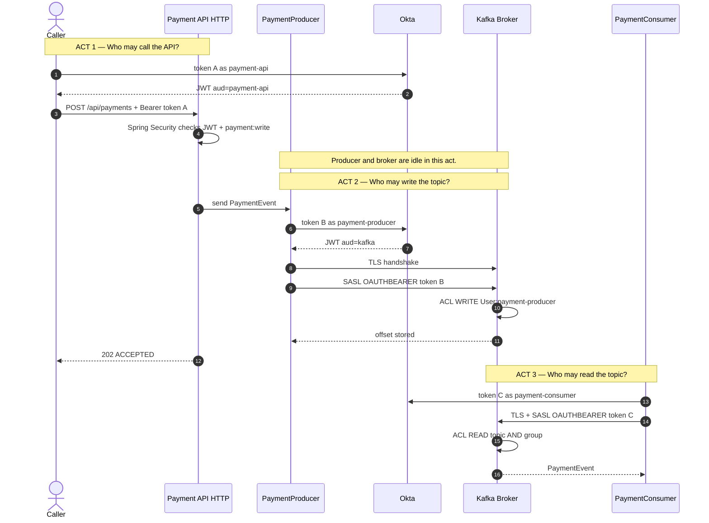
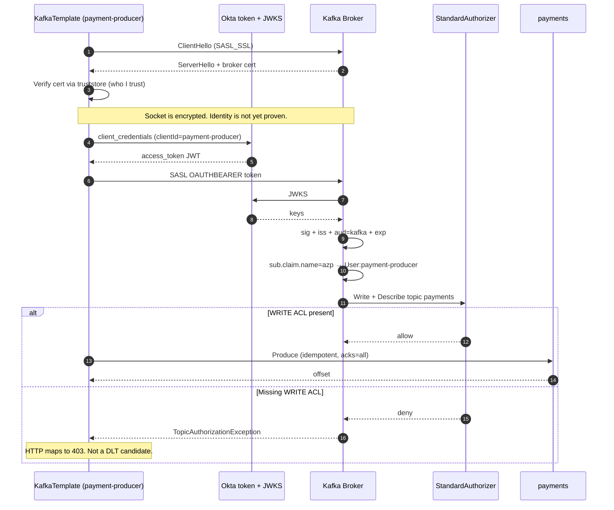
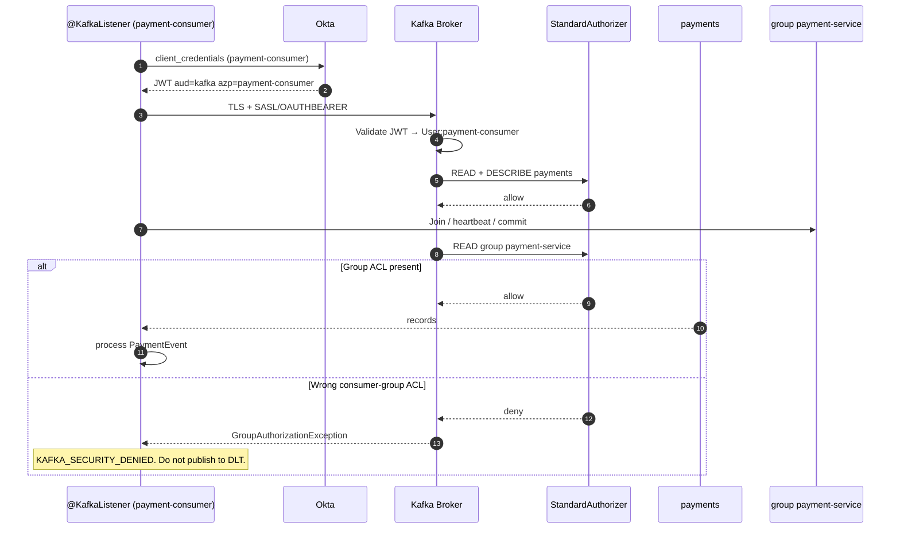
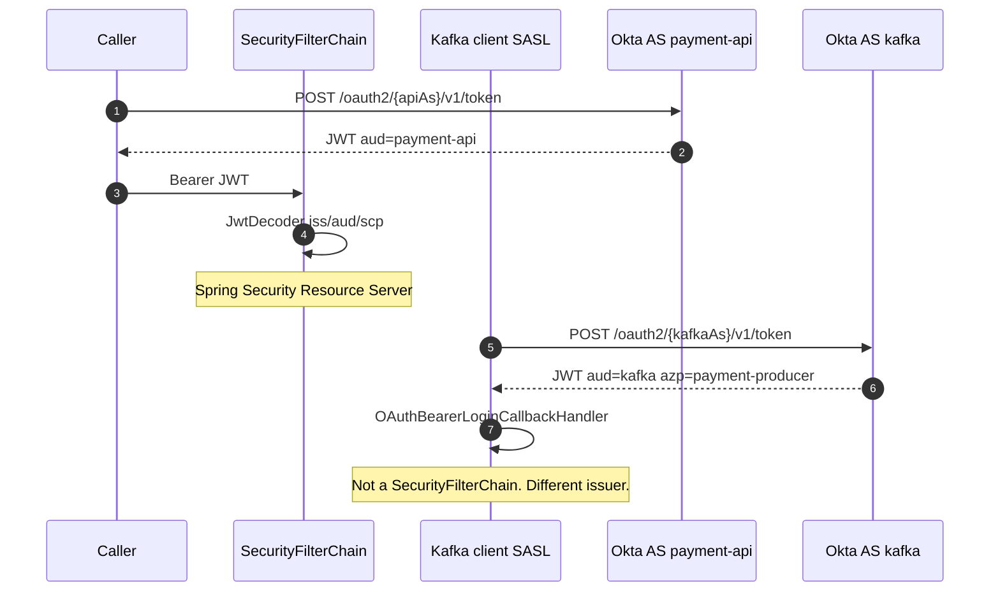
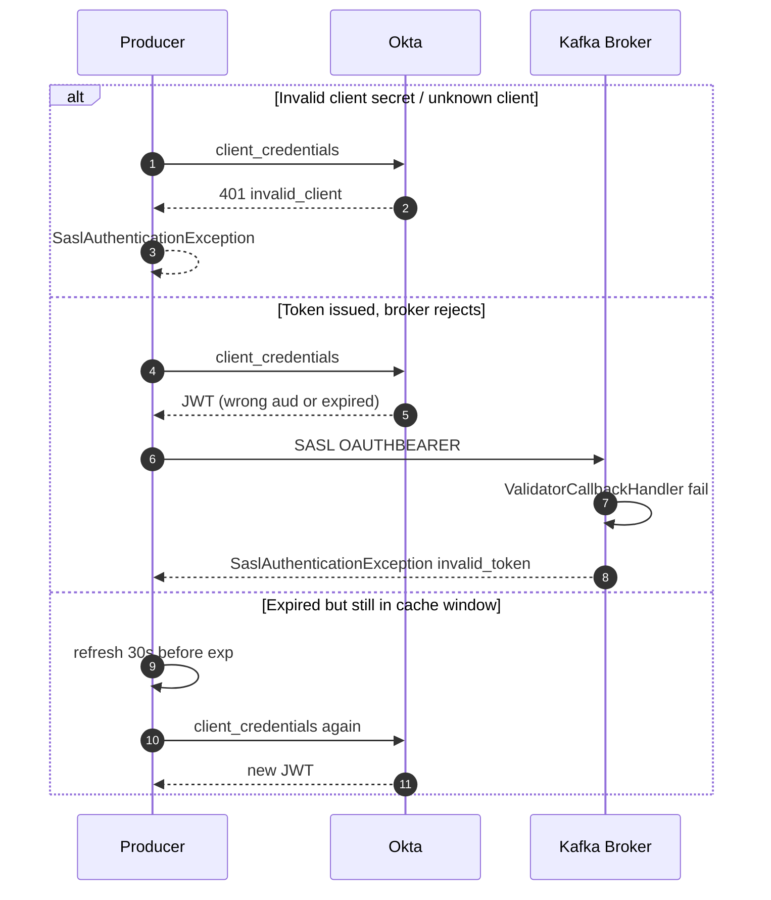
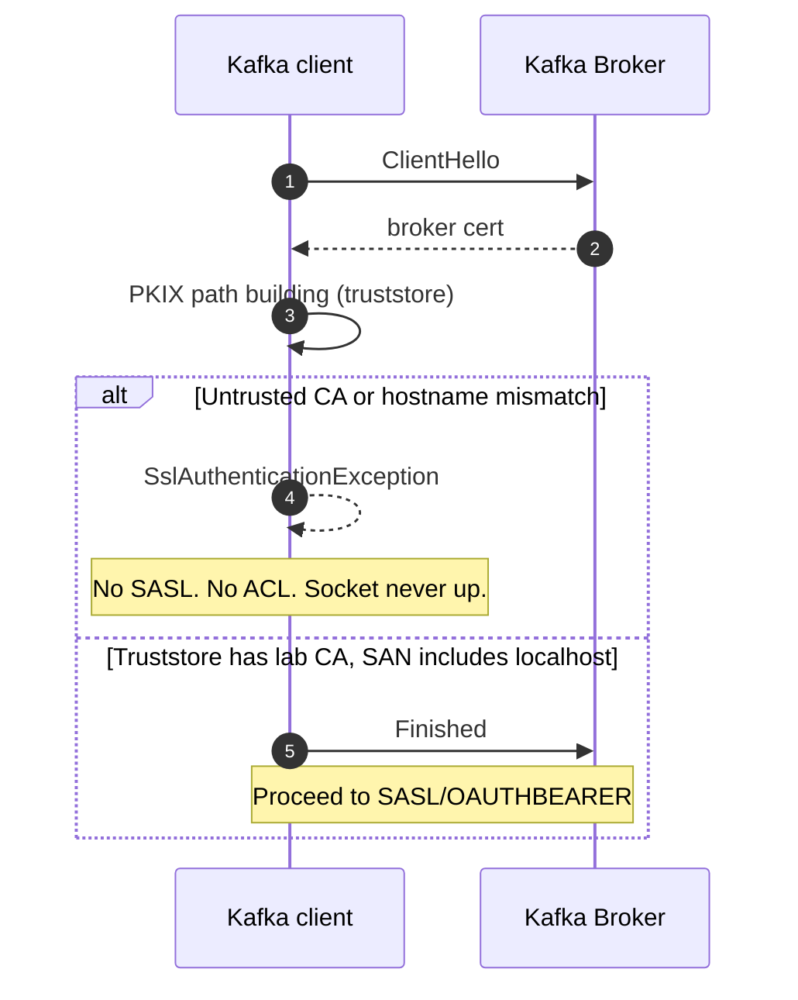

# Secure Kafka flows

Same IdP. Two validation planes. Spring Security never sees the SASL handshake.

## End-to-end: three questions

Do not memorize every callback class. Remember the three questions. Token A never goes to Kafka.

**Say this:** Caller gets an HTTP JWT. The API then gets a *different* JWT for Kafka. Kafka checks TLS, then the JWT,
then the ACL. Producer needs WRITE. Consumer needs READ on the topic *and* the group. Bad JWT is 401. Missing ACL is
403 — not a DLT.

## Producer only (TLS → token → ACL → write)

## Consumer only (token → topic ACL → group ACL → poll)

## Two tokens, two audiences (do not mix)

## Failure: invalid or expired Kafka JWT

## Failure: TLS handshake

