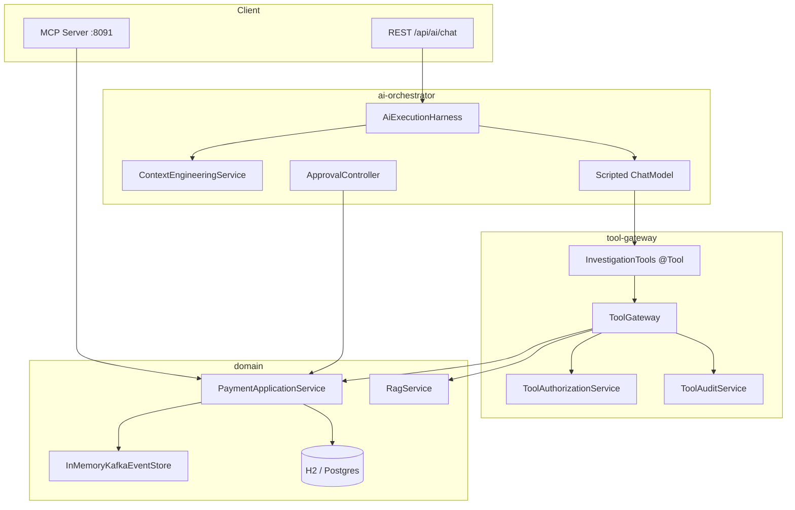

# Architecture

## Principles

1. **AI never touches DB/Kafka directly** — only `@Tool` methods via `ToolGateway`
2. **AI never executes financial writes** — `payment.execute` blocked; HITL for retry/execute
3. **Context Engineering** builds prioritized, budgeted, PII-filtered prompt context
4. **Harness** enforces auth → validate → context → tools → structured output → audit → metrics

## Harness state machine

`RECEIVED → AUTHORIZED → CONTEXT_BUILT → RAG_RETRIEVED → MODEL_CALLED → TOOL_CALLING → TOOL_RESULTS_VALIDATED → OUTPUT_VALIDATED → COMPLETED | APPROVAL_REQUIRED | FAILED`
