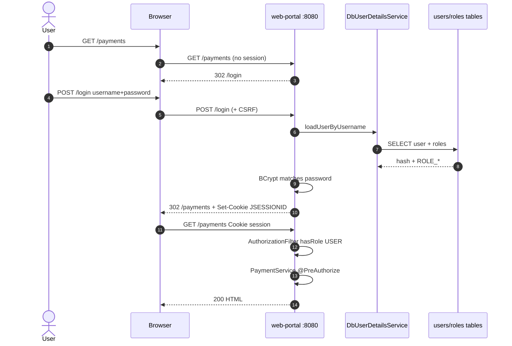
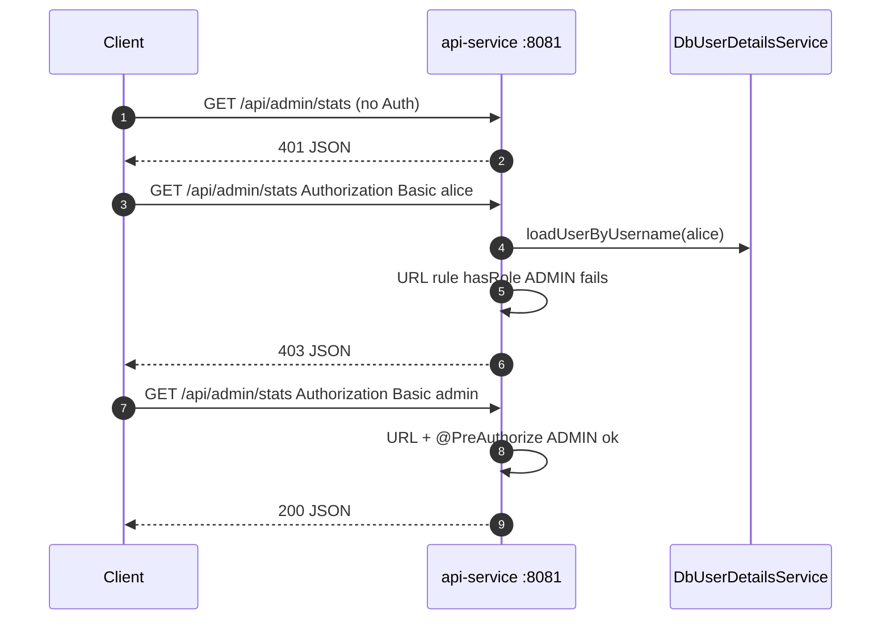
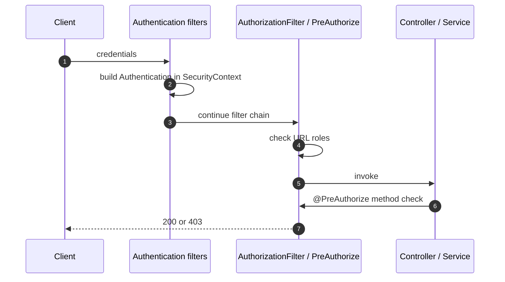

# Flows (no OAuth)

## Form login (web-portal)

```mermaid
sequenceDiagram
    autonumber
    actor User
    participant Browser
    participant Portal as web-portal :8080
    participant UDS as DbUserDetailsService
    participant DB as users/roles tables

    User->>Browser: GET /payments
    Browser->>Portal: GET /payments (no session)
    Portal-->>Browser: 302 /login
    User->>Browser: POST /login username+password
    Browser->>Portal: POST /login (+ CSRF)
    Portal->>UDS: loadUserByUsername
    UDS->>DB: SELECT user + roles
    DB-->>UDS: hash + ROLE_*
    Portal->>Portal: BCrypt matches password
    Portal-->>Browser: 302 /payments + Set-Cookie JSESSIONID
    Browser->>Portal: GET /payments Cookie session
    Portal->>Portal: AuthorizationFilter hasRole USER
    Portal->>Portal: PaymentService @PreAuthorize
    Portal-->>Browser: 200 HTML
```

## HTTP Basic API (api-service)

```mermaid
sequenceDiagram
    autonumber
    participant Client
    participant API as api-service :8081
    participant UDS as DbUserDetailsService

    Client->>API: GET /api/admin/stats (no Auth)
    API-->>Client: 401 JSON
    Client->>API: GET /api/admin/stats Authorization Basic alice
    API->>UDS: loadUserByUsername(alice)
    API->>API: URL rule hasRole ADMIN fails
    API-->>Client: 403 JSON
    Client->>API: GET /api/admin/stats Authorization Basic admin
    API->>API: URL + @PreAuthorize ADMIN ok
    API-->>Client: 200 JSON
```

## Authn vs Authz split inside one app

```mermaid
sequenceDiagram
    autonumber
    participant Client
    participant Authn as Authentication filters
    participant Authz as AuthorizationFilter / PreAuthorize
    participant App as Controller / Service

    Client->>Authn: credentials
    Authn->>Authn: build Authentication in SecurityContext
    Authn->>Authz: continue filter chain
    Authz->>Authz: check URL roles
    Authz->>App: invoke
    App->>Authz: @PreAuthorize method check
    Authz-->>Client: 200 or 403
```
