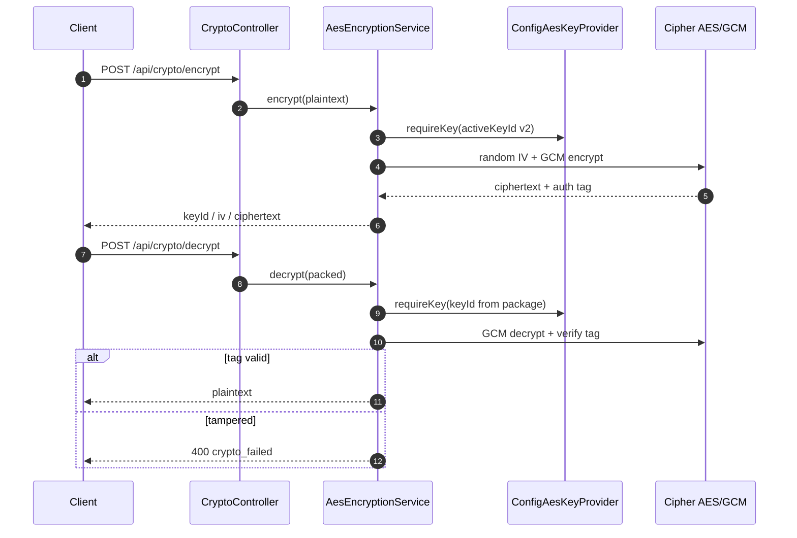
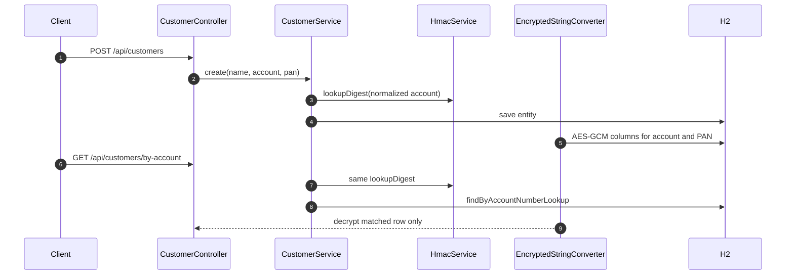

# spring-encryption-lab

Runnable Spring Boot 3.4 / Java 21 lab for the **Encryption & Decryption** hub.

## Run

```bash
cd spring-encryption-lab
mvn spring-boot:run
```

API: `http://localhost:8093`

## Local keys (dev only)

`application.yml` ships with **fake** Base64 AES keys and a local HMAC secret. Production must load keys from **KMS / Secrets Manager / Vault** via env:

```bash
export CRYPTO_KEY_V1=...
export CRYPTO_KEY_V2=...
export CRYPTO_LOOKUP_HMAC=...
```

Never commit real keys. Never log PAN, JWT, or plaintext secrets.

## Quick curl

```bash
# AES-GCM encrypt
curl -s -X POST localhost:8093/api/crypto/encrypt \
  -H 'Content-Type: application/json' \
  -d '{"plaintext":"4111111111111111"}'

# Hybrid RSA-OAEP + AES-GCM
curl -s -X POST localhost:8093/api/crypto/hybrid/encrypt \
  -H 'Content-Type: application/json' \
  -d '{"plaintext":"large-json-payload"}'

# PKI: issue a leaf, validate SAN, sign, encrypt-to-cert
curl -s localhost:8093/api/crypto/pki/ca

ISSUE=$(curl -s -X POST localhost:8093/api/crypto/pki/issue \
  -H 'Content-Type: application/json' \
  -d '{"cn":"CN=payments.example","san":["payments.example"]}')

# validate hostname (trusted=true) vs evil.example (hostname_mismatch)

# Field encryption + searchable lookup
curl -s -X POST localhost:8093/api/customers \
  -H 'Content-Type: application/json' \
  -d '{"name":"Ada","accountNumber":"ACC-1001","pan":"4111111111111111"}'

curl -s 'localhost:8093/api/customers/by-account?accountNumber=ACC-1001'
```

## Ciphertext format

```text
keyId|iv|ciphertext   (Base64url parts, AES-GCM)
```

Rotation: encrypt with `crypto.active-key-id`; decrypt by `keyId` in the package; re-encrypt via `/api/crypto/reencrypt`.

## End-to-end sequence (AES-GCM)



## End-to-end sequence (customer searchable field)



