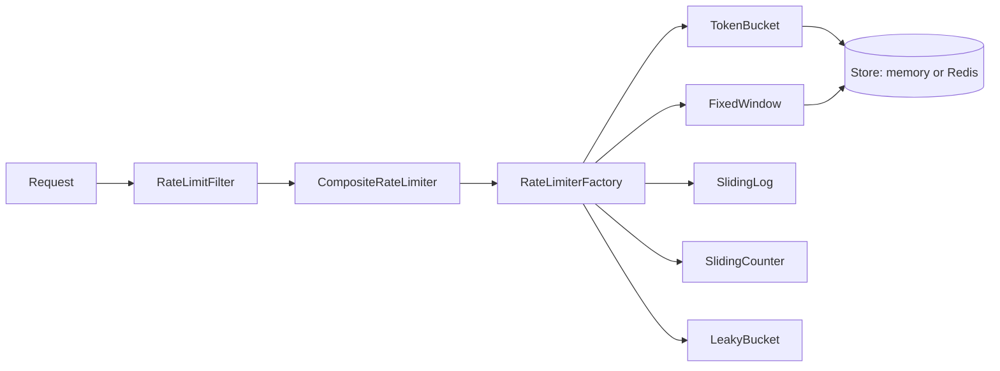

# Spring Rate Limiter Laboratory

Production-shaped rate limiter lab for **Senior/Staff system-design interviews**. Implements five algorithms with in-memory stores, Redis Lua for token bucket + fixed window, multi-level policies, fail-open/fail-closed, and a playground API.

## Algorithms

| Algorithm | Package class | Burst behavior | Distributed store |
|-----------|---------------|----------------|-------------------|
| `TOKEN_BUCKET` | `TokenBucketRateLimiter` | Configurable burst (`capacity`) + sustained refill | Redis `token_bucket.lua` |
| `LEAKY_BUCKET` | `LeakyBucketRateLimiter` | Smooth drain; overflow rejects | In-memory only |
| `FIXED_WINDOW` | `FixedWindowRateLimiter` | Resets each window; **boundary burst** risk | Redis `fixed_window.lua` |
| `SLIDING_WINDOW_LOG` | `SlidingWindowLogRateLimiter` | Accurate; memory O(limit) per key | In-memory only |
| `SLIDING_WINDOW_COUNTER` | `SlidingWindowCounterRateLimiter` | Weighted prev+current estimate | In-memory only |



## Run

```bash
cd spring-rate-limiter-lab
mvn test
mvn spring-boot:run          # http://127.0.0.1:8098
```

Default store is **in-memory** (`rate-limit.store=memory`) so `mvn test` needs no Redis.

### Redis profile

```bash
docker compose up -d
mvn spring-boot:run -Dspring-boot.run.profiles=redis
```

Or set `rate-limit.store=redis` in config (see `application-redis.yml`).

## Playground API (in-memory, no Redis)

List algorithms:

```bash
curl -sS http://127.0.0.1:8098/api/lab/algorithms | jq .
```

Try an algorithm (`X-Lab-Key` isolates counters per key; `cost` consumes weighted permits):

```bash
curl -sS 'http://127.0.0.1:8098/api/lab/TOKEN_BUCKET?cost=1' \
  -H 'X-Lab-Key: demo-key' | jq .

curl -sS 'http://127.0.0.1:8098/api/lab/FIXED_WINDOW?cost=2' \
  -H 'X-Lab-Key: demo-key' | jq .

curl -sS 'http://127.0.0.1:8098/api/lab/SLIDING_WINDOW_LOG?cost=1' \
  -H 'X-Lab-Key: demo-key' | jq .
```

Load generator:

```bash
./scripts/load-gen.sh
# or
mvn -q exec:java -Dexec.mainClass=com.vibhu.ratelimit.LoadGenerator -Dexec.args=50
```

## Production demo (filter + policies)

```bash
curl -i -X POST http://127.0.0.1:8098/api/payments \
  -H 'X-Tenant-Id: acme' \
  -H 'X-Client-Id: client-123' \
  -H 'X-User-Id: user-1'

curl -sS http://127.0.0.1:8098/api/rate-limits | jq .
```

Rejected responses are **429** with `X-RateLimit-*` and `Retry-After`.

## Fail policies

| Policy | When Redis/store throws |
|--------|-------------------------|
| `FAIL_OPEN` | Allow request (degraded) |
| `FAIL_CLOSED` | Reject request |
| `LOCAL_FALLBACK` | Enforce in-process store on same JVM |

Applied in `AbstractStoreBackedRateLimiter` for all store-backed algorithms.

## Redis Lua

- `src/main/resources/lua/token_bucket.lua` — atomic refill + consume (single key, Cluster-safe)
- `src/main/resources/lua/fixed_window.lua` — atomic window counter

## Weighted requests

`RequestContext.cost` (default `1.0`) and `WeightedRateLimiter` wrapper multiply permit consumption for batch/heavy endpoints.

## Interview spine

```text
Shared quota     → Redis (not per-JVM HashMap)
Atomic update    → Lua or ConcurrentHashMap.compute
Algorithm choice → burst vs smooth vs accuracy vs memory
Multi-level      → Composite AND of matching policies
Redis down       → fail-closed on payments, fail-open on reads
```

See `INTERVIEW.md`, `RATE_LIMITER_CHEAT_SHEET.md`, and `COMMON_MISTAKES.md`.
