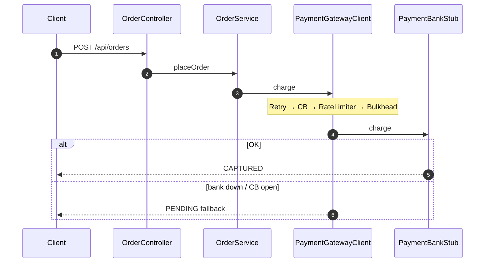

# spring-resilience4j-lab

Spring Boot 3.4 + Resilience4j 2.4 payment lab: CircuitBreaker, Retry, RateLimiter, Bulkhead,
ThreadPool Bulkhead, TimeLimiter, Caffeine cache, idempotency, PENDING fallback, events, Actuator.

```bash
mvn test
mvn spring-boot:run
```

```bash
# pay (Idempotency-Key is the JSON field)
curl -sS -X POST http://127.0.0.1:8087/api/orders \
  -H 'Content-Type: application/json' \
  -d '{"idempotencyKey":"PAYMENT-12345","customerId":"c1","amountCents":1000}'

# simulate bank (disabled under --spring.profiles.active=prod)
curl -sS 'http://127.0.0.1:8087/api/payment/simulate?mode=DOWN'
curl -sS 'http://127.0.0.1:8087/api/payment/simulate?mode=FLAKY'
curl -sS 'http://127.0.0.1:8087/api/payment/simulate?mode=SLOW'

# FX cache
curl -sS http://127.0.0.1:8087/api/fx

# Actuator (protect in production)
curl -sS http://127.0.0.1:8087/actuator/health
curl -sS http://127.0.0.1:8087/actuator/circuitbreakers
```

Modes: `OK`, `ERROR`, `FLAKY`, `SLOW`, `DOWN`, `REJECT`. Fallback returns **PENDING**, never fake CAPTURED.

Default Spring AOP nesting: Retry → CircuitBreaker → RateLimiter → TimeLimiter → Bulkhead → method.

## Code walkthrough (no memorizing)



Full clickable sequences live on the site hub `/resilience4j` → **Code Walkthrough Sequences**.

